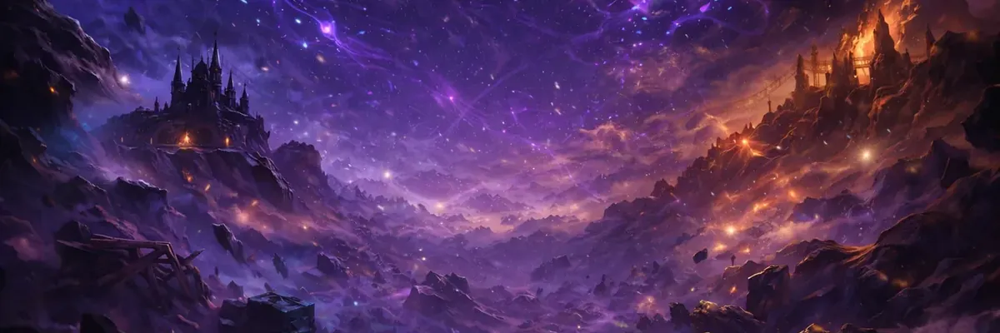
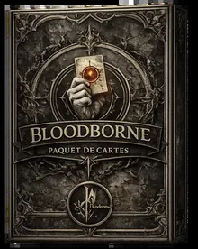
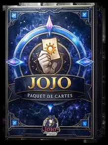
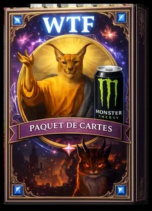

<a href="./README.md">
  <picture>
    <source media="(max-width: 720px)" srcset="./docs/assets/hero/cosmos_sm.webp">
    
  </picture>
</a>

# Galerie des cartes

**181 cartes** réparties sur **3 univers**, **4 raretés**, **3 statuts**.

  
  
  

> Cliquez sur une carte pour aller au détail. Catalogue jouable : [**omnicard.fr**](https://omnicard.fr).

[← Retour au README](./README.md) · [Règles](./docs/rules.md) · [Mots-clés](./docs/keywords.md) · [Économie](./docs/economy.md)

---

## Navigation rapide

<table>
<tr>
  <th>Univers</th>
  <th align="right">Cartes</th>
  <th>Catalogue détaillé</th>
  <th>Présentation</th>
</tr>
<tr>
  <td><a href="#bloodborne"><strong>Bloodborne</strong></a></td>
  <td align="right">114</td>
  <td><a href="./docs/cards/bloodborne.md">→ docs/cards/bloodborne.md</a></td>
  <td><a href="./docs/universes/bloodborne.md">→ univers</a></td>
</tr>
<tr>
  <td><a href="#jojos-bizarre-adventure"><strong>JoJo's Bizarre Adventure</strong></a></td>
  <td align="right">51</td>
  <td><a href="./docs/cards/jojo.md">→ docs/cards/jojo.md</a></td>
  <td><a href="./docs/universes/jojo.md">→ univers</a></td>
</tr>
<tr>
  <td><a href="#wtf"><strong>WTF</strong></a></td>
  <td align="right">16</td>
  <td><a href="./docs/cards/wtf.md">→ docs/cards/wtf.md</a></td>
  <td><a href="./docs/universes/wtf.md">→ univers</a></td>
</tr>
<tr>
  <td><strong>Total</strong></td>
  <td align="right"><strong>181</strong></td>
  <td colspan="2"></td>
</tr>
</table>

---

## Statistiques globales

<table>
<tr>
  <th>Critère</th>
  <th align="right">Bloodborne</th>
  <th align="right">JoJo</th>
  <th align="right">WTF</th>
  <th align="right">Total</th>
</tr>
<tr><td>🟢 <strong>Commun</strong></td><td align="right">50</td><td align="right">27</td><td align="right">3</td><td align="right"><strong>80</strong></td></tr>
<tr><td>🔵 <strong>Rare</strong></td><td align="right">29</td><td align="right">15</td><td align="right">6</td><td align="right"><strong>50</strong></td></tr>
<tr><td>🟣 <strong>Épique</strong></td><td align="right">19</td><td align="right">6</td><td align="right">4</td><td align="right"><strong>29</strong></td></tr>
<tr><td>🟡 <strong>Ultime</strong></td><td align="right">16</td><td align="right">3</td><td align="right">3</td><td align="right"><strong>22</strong></td></tr>
<tr><td><strong>Total cartes</strong></td><td align="right"><strong>114</strong></td><td align="right"><strong>51</strong></td><td align="right"><strong>16</strong></td><td align="right"><strong>181</strong></td></tr>
<tr><td>dont <em>Base</em></td><td align="right">50</td><td align="right">36</td><td align="right">7</td><td align="right"><strong>93</strong></td></tr>
<tr><td>dont <em>Légendaire</em></td><td align="right">20</td><td align="right">7</td><td align="right">5</td><td align="right"><strong>32</strong></td></tr>
<tr><td>dont <em>Invocation</em></td><td align="right">26</td><td align="right">8</td><td align="right">4</td><td align="right"><strong>38</strong></td></tr>
</table>

Les Invocations sont générées par effets (jamais directement dans un deck).

---

## Bloodborne

<table>
<tr>
<td width="200" valign="top" align="center">
  
</td>
<td valign="top">

**L'univers le plus profond.**
Chasseurs, Bêtes, Gemmes à larme. Mécaniques d'Affûtage, transformations, buffs Chasseur/Grand.

📊 **114 cartes** · 50 Communes · 29 Rares · 19 Épiques · 16 Ultimes
🧬 Familles : *Chasseur* · *Grand* · *Outil* · *Offrande* · *Ésotérisme* · *Rune* · *Gemme* · *Bête* · *Boss*

[**→ Présentation de l'univers**](./docs/universes/bloodborne.md) · [**→ Catalogue complet (114)**](./docs/cards/bloodborne.md)

</td>
</tr>
</table>

### Cartes phares

<table>
<tr>
<td align="center" width="33%" valign="top">
 
<strong>Gehrman : Premier Chasseur</strong> 
Légendaire Ultime. Le finisher mono-Chasseur — invoque un Chasseur ≤ 6 chaque fin de tour.
</td>
<td align="center" width="33%" valign="top">
 
<strong>Iosefka</strong> 
Anti-Magie permanente. Le mur contre les sorts adverses.
</td>
<td align="center" width="33%" valign="top">
 
<strong>Présence Lunaire</strong> 
Légendaire Grand. Provocation Totale — tout passe par elle.
</td>
</tr>
<tr>
<td align="center" width="33%" valign="top">
 
<strong>Lune Sanglante</strong> 
Buff global +1/+0 à toute la famille Grand. Le pivot des decks Grand.
</td>
<td align="center" width="33%" valign="top">
 
<strong>Amygdala</strong> 
À Extase ≥ 20, tout Grand sur Terrain gagne Robustesse(1). Récompense les decks longs.
</td>
<td align="center" width="33%" valign="top">
 
<strong>L&#x27;atelier du Chasseur</strong> 
Terrain Chasseur — Affûtage(1,1) sur tous les Gear chaque fin de tour.
</td>
</tr>
</table>

<a href="./docs/cards/bloodborne.md"><strong>→ Voir les 114 cartes Bloodborne</strong></a>

---

## JoJo's Bizarre Adventure

<table>
<tr>
<td width="200" valign="top" align="center">
  
</td>
<td valign="top">

**Chaînes de transformation et combos de pose.**
Joestar, Vampires, Onde (Hamon). Stand-like buffs et forme finale.

📊 **51 cartes** · 27 Communes · 15 Rares · 6 Épiques · 3 Ultimes
🧬 Familles : *Joestar* · *Vampire* · *Onde / Hamon*

[**→ Présentation de l'univers**](./docs/universes/jojo.md) · [**→ Catalogue complet (51)**](./docs/cards/jojo.md)

</td>
</tr>
</table>

### Cartes phares

<table>
<tr>
<td align="center" width="33%" valign="top">
 
<strong>Jonathan Joestar : Maître de l&#x27;Onde</strong> 
Maître de l&#x27;Onde. Frappe distante. Forme avancée de Jonathan.
</td>
<td align="center" width="33%" valign="top">
 
<strong>Jonathan Joestar : Maître du Combat</strong> 
Maître du Combat. Forme finale de Jonathan, Provocation Totale.
</td>
<td align="center" width="33%" valign="top">
 
<strong>Dio Brando : Vampire</strong> 
Légendaire. Forme finale de la chaîne Dio. Win condition Vampire.
</td>
</tr>
<tr>
<td align="center" width="33%" valign="top">
 
<strong>Danny</strong> 
Dernier Souffle : +1/+1 à toute la famille Joestar.
</td>
<td align="center" width="33%" valign="top">
 
<strong>Wang Chan</strong> 
Oblitérer — supprime une carte ennemie sans cimetière. Coupe les Dernier Souffle.
</td>
<td align="center" width="33%" valign="top">
 
<strong>Zeppeli</strong> 
Le mentor d&#x27;Hamon. Pivot des decks Onde.
</td>
</tr>
</table>

<a href="./docs/cards/jojo.md"><strong>→ Voir les 51 cartes JoJo's Bizarre Adventure</strong></a>

---

## WTF

<table>
<tr>
<td width="200" valign="top" align="center">
  
</td>
<td valign="top">

**Chaos assumé, références meme, peu de cartes mais beaucoup d'impact.**
Floppa, GitGud, Ricardo, Vibecoder. Pour casser le sérieux.

📊 **16 cartes** · 3 Communes · 6 Rares · 4 Épiques · 3 Ultimes
🧬 Familles : *Floppa* · *meme* · *troll*

[**→ Présentation de l'univers**](./docs/universes/wtf.md) · [**→ Catalogue complet (16)**](./docs/cards/wtf.md)

</td>
</tr>
</table>

### Cartes phares

<table>
<tr>
<td align="center" width="33%" valign="top">
 
<strong>Floppa : Divinité</strong> 
Légendaire. Délai 2 → 100 dégâts à l&#x27;adversaire. La menace ultime.
</td>
<td align="center" width="33%" valign="top">
 
<strong>GitGud</strong> 
Force le match nul. La carte troll par excellence.
</td>
<td align="center" width="33%" valign="top">
 
<strong>Sur les traces de Floppa…</strong> 
Ajoute toute la chaîne Floppa à votre deck. Le starter du build Floppa.
</td>
</tr>
<tr>
<td align="center" width="33%" valign="top">
 
<strong>Ricardo</strong> 
Scale avec le nombre de cartes WTF jouées. Récompense les decks 100% WTF.
</td>
<td align="center" width="33%" valign="top">
 
<strong>Vibecoder</strong> 
Espion(1) — bascule chez l&#x27;adversaire à 0. Cadeau empoisonné.
</td>
<td align="center" width="33%" valign="top">
 
<strong>Floppa : Assassin</strong> 
Forme Assassin de Floppa. Ignore les ripostes, gagne en survivabilité.
</td>
</tr>
</table>

<a href="./docs/cards/wtf.md"><strong>→ Voir les 16 cartes WTF</strong></a>

---

## Légende rapide

### Types de carte

| Type | Rôle |
|---|---|
| 🛡️ **Unité** | Créature sur le plateau, attaque et encaisse. PV + Attaque. |
| ✨ **Sort** | Effet immédiat à usage unique, va au cimetière. |
| ⚔️ **Gear** | Équipement attaché à une unité, ajoute ses stats. Encaisse en priorité. |
| 🌍 **Terrain** | Modifie les règles globales tant qu'il est en jeu. 1 actif max. |
| 🪤 **Piège** | Face cachée, déclenché par une condition adverse. |

### Statuts (limites par deck de 40 cartes)

| Statut | Limite |
|---|---|
| **Base** | 3 copies max par carte |
| **Légendaire** | 1 copie max par carte |
| **Invocation** | Jamais directement — générée par effets uniquement |

### Raretés (économie de packs)

| Rareté | Drop pack | Coût d'achat ciblé |
|---|---:|---:|
| 🟢 Commun | 80 % | 100 fragments |
| 🔵 Rare | 15 % | 200 fragments |
| 🟣 Épique | 4 % | 400 fragments |
| 🟡 Ultime | 1 % | 800 fragments |

Détail : [`docs/economy.md`](./docs/economy.md).

### Mots-clés et mécaniques

Tous les mots-clés (Anti-Magie, Provocation, Esquive, Affûtage, Délai, Extase, etc.)
sont documentés dans [`docs/keywords.md`](./docs/keywords.md).

---

[← Retour au README](./README.md) ·
[Catalogue Bloodborne](./docs/cards/bloodborne.md) ·
[Catalogue JoJo](./docs/cards/jojo.md) ·
[Catalogue WTF](./docs/cards/wtf.md)

