# Galerie des cartes

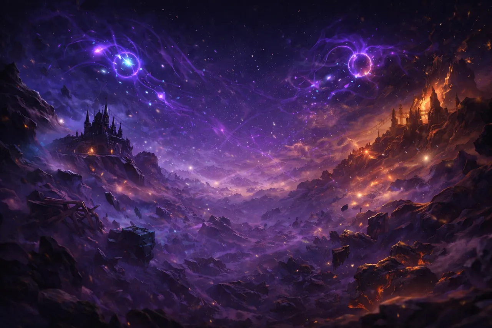

> Vitrine des **181 cartes** d'Omnicard, réparties en 3 univers.

> Cliquez sur une carte ou un lien pour aller au détail. Catalogue jouable : [test.omnicard.fr](https://test.omnicard.fr).

## Navigation rapide

| Univers | Cartes | Catalogue détaillé |
|---|---:|---|
| [Bloodborne](#bloodborne) | 114 | [→ docs/cards/bloodborne.md](./docs/cards/bloodborne.md) |
| [JoJo's Bizarre Adventure](#jojos-bizarre-adventure) | 51 | [→ docs/cards/jojo.md](./docs/cards/jojo.md) |
| [WTF](#wtf) | 16 | [→ docs/cards/wtf.md](./docs/cards/wtf.md) |
| **Total** | **181** | |

## Stats globales

| Critère | Bloodborne | JoJo | WTF | **Total** |
|---|---:|---:|---:|---:|
| **Commun** | 50 | 27 | 3 | **80** |
| **Rare** | 29 | 15 | 6 | **50** |
| **Épique** | 19 | 6 | 4 | **29** |
| **Ultime** | 16 | 3 | 3 | **22** |
| **Total cartes** | **114** | **51** | **16** | **181** |
| dont **Base** | 50 | 36 | 7 | **93** |
| dont **Légendaire** | 20 | 7 | 5 | **32** |
| dont **Invocation** | 26 | 8 | 4 | **38** (générées par effets) |

---

## Bloodborne

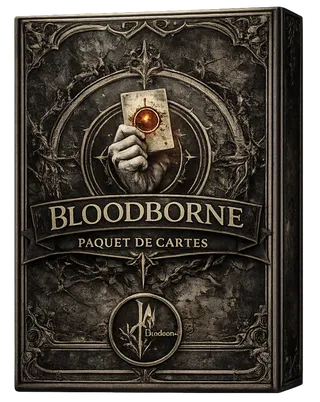

L'univers le plus profond. Chasseurs, Bêtes, Gemmes à larme. Mécaniques d'Affûtage, transformations, buffs Chasseur/Grand. 114 cartes.

 

### Quelques cartes phares

<table>
<tr>
<td align="center" width="33%" valign="top">
<a href="./docs/cards/bloodborne.md#card-10">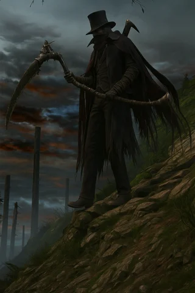</a> 
<strong>Gehrman : Premier Chasseur</strong> 
Légendaire Ultime. Le finisher mono-Chasseur — invoque un Chasseur ≤ 6 chaque fin de tour.
</td>
<td align="center" width="33%" valign="top">
<a href="./docs/cards/bloodborne.md#card-12">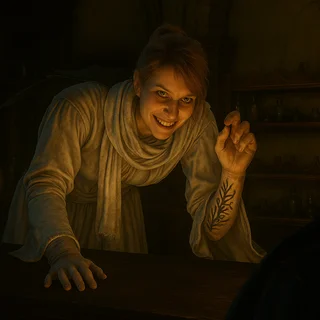</a> 
<strong>Iosefka</strong> 
Anti-Magie permanente. Le mur contre les sorts adverses.
</td>
<td align="center" width="33%" valign="top">
<a href="./docs/cards/bloodborne.md#card-17">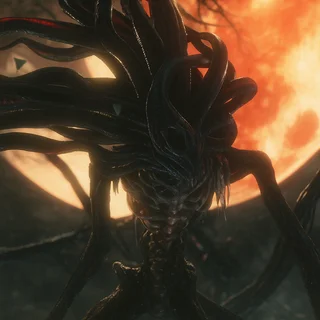</a> 
<strong>Présence Lunaire</strong> 
Légendaire Grand. Provocation Totale — tout passe par elle.
</td>
</tr>
<tr>
<td align="center" width="33%" valign="top">
<a href="./docs/cards/bloodborne.md#card-175">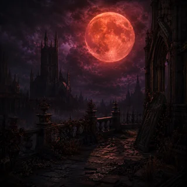</a> 
<strong>Lune Sanglante</strong> 
Buff global +1/+0 à toute la famille Grand. Le pivot des decks Grand.
</td>
<td align="center" width="33%" valign="top">
<a href="./docs/cards/bloodborne.md#card-166">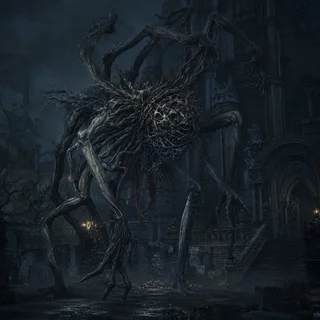</a> 
<strong>Amygdala</strong> 
À Extase ≥ 20, tout Grand sur Terrain gagne Robustesse(1). Récompense les decks longs.
</td>
<td align="center" width="33%" valign="top">
<a href="./docs/cards/bloodborne.md#card-18">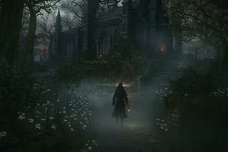</a> 
<strong>L&#x27;atelier du Chasseur</strong> 
Terrain Chasseur — Affûtage(1,1) sur tous les Gear chaque fin de tour.
</td>
</tr>
</table>

<a href="./docs/cards/bloodborne.md"><strong>→ Voir les 114 cartes Bloodborne →</strong></a>

---

## JoJo's Bizarre Adventure

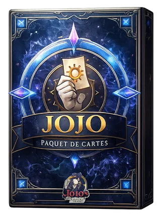

Chaînes de transformation et combos de pose. Joestar, Vampires, Onde (Hamon). 51 cartes.

 

### Quelques cartes phares

<table>
<tr>
<td align="center" width="33%" valign="top">
<a href="./docs/cards/jojo.md#card-80">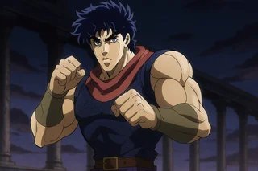</a> 
<strong>Jonathan Joestar: Maitre de l&#x27;onde</strong> 
Maître de l&#x27;Onde. Frappe distante. Forme avancée de Jonathan.
</td>
<td align="center" width="33%" valign="top">
<a href="./docs/cards/jojo.md#card-81">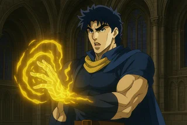</a> 
<strong>Jonathan Joestar: Maitre du combat</strong> 
Maître du Combat. Forme finale de Jonathan, Provocation Totale.
</td>
<td align="center" width="33%" valign="top">
<a href="./docs/cards/jojo.md#card-88">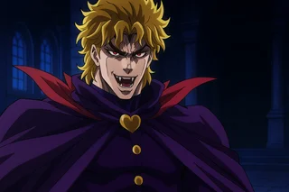</a> 
<strong>Dio Brando: Vampire</strong> 
Légendaire. Forme finale de la chaîne Dio. Win condition Vampire.
</td>
</tr>
<tr>
<td align="center" width="33%" valign="top">
<a href="./docs/cards/jojo.md#card-76">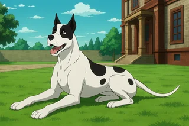</a> 
<strong>Danny</strong> 
Dernier Souffle : +1/+1 à toute la famille Joestar.
</td>
<td align="center" width="33%" valign="top">
<a href="./docs/cards/jojo.md#card-86">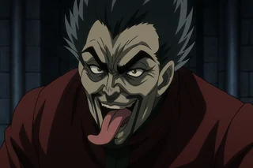</a> 
<strong>Wang Chan</strong> 
Oblitérer — supprime une carte ennemie sans cimetière. Coupe les Dernier Souffle.
</td>
<td align="center" width="33%" valign="top">
<a href="./docs/cards/jojo.md#card-83">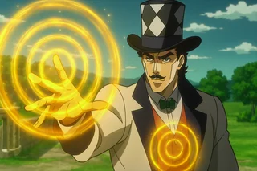</a> 
<strong>Zeppeli</strong> 
Le mentor d&#x27;Hamon. Pivot des decks Onde.
</td>
</tr>
</table>

<a href="./docs/cards/jojo.md"><strong>→ Voir les 51 cartes JoJo's Bizarre Adventure →</strong></a>

---

## WTF

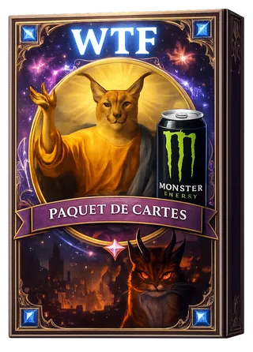

Chaos assumé, références meme, peu de cartes mais beaucoup d'impact. Floppa, GitGud, Ricardo. 16 cartes.

 

### Quelques cartes phares

<table>
<tr>
<td align="center" width="33%" valign="top">
<a href="./docs/cards/wtf.md#card-8">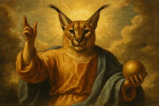</a> 
<strong>Floppa: Divinité</strong> 
Légendaire. Délai 2 → 100 dégâts à l&#x27;adversaire. La menace ultime.
</td>
<td align="center" width="33%" valign="top">
<a href="./docs/cards/wtf.md#card-9">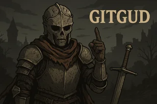</a> 
<strong>GitGud</strong> 
Force le match nul. La carte troll par excellence.
</td>
<td align="center" width="33%" valign="top">
<a href="./docs/cards/wtf.md#card-4">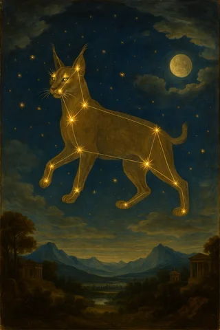</a> 
<strong>Sur les traces de Floppa..</strong> 
Ajoute toute la chaîne Floppa à votre deck. Le starter du build Floppa.
</td>
</tr>
<tr>
<td align="center" width="33%" valign="top">
 
<strong>Ricardo</strong> 
Scale avec le nombre de cartes WTF jouées. Récompense les decks 100% WTF.
</td>
<td align="center" width="33%" valign="top">
 
<strong>Vibecoder</strong> 
Espion(1) — bascule chez l&#x27;adversaire à 0. Cadeau empoisonné.
</td>
<td align="center" width="33%" valign="top">
<a href="./docs/cards/wtf.md#card-7">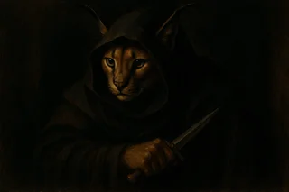</a> 
<strong>Floppa: Assassin</strong> 
Forme Assassin de Floppa. Ignore les ripostes, gagne en survivabilité.
</td>
</tr>
</table>

<a href="./docs/cards/wtf.md"><strong>→ Voir les 16 cartes WTF →</strong></a>

---

## Légende rapide

### Types de carte

| Type | Rôle |
|---|---|
| **Unité** | Créature sur le plateau, attaque et encaisse. PV + Attaque. |
| **Sort** | Effet immédiat à usage unique, va au cimetière. |
| **Gear** | Équipement attaché à une unité, ajoute ses stats. Encaisse en priorité. |
| **Terrain** | Modifie les règles globales tant qu'il est en jeu. 1 actif max. |
| **Piège** | Face cachée, déclenché par une condition adverse. |

### Statuts (limites par deck de 40 cartes)

| Statut | Limite |
|---|---|
| **Base** | 3 copies max par carte |
| **Légendaire** | 1 copie max par carte |
| **Invocation** | Jamais directement — générée par effets uniquement |

### Raretés (économie de packs)

| Rareté | Drop pack | Coût d'achat ciblé |
|---|---:|---:|
| Commun | 80 % | 100 fragments |
| Rare | 15 % | 200 fragments |
| Épique | 4 % | 400 fragments |
| Ultime | 1 % | 800 fragments |

Détail : [`docs/economy.md`](./docs/economy.md).

### Mots-clés et mécaniques

Tous les mots-clés (Anti-Magie, Provocation, Esquive, Affûtage, Délai, Extase, etc.) sont documentés dans [`docs/keywords.md`](./docs/keywords.md).

---

<a href="./README.md">← Retour au README</a> ·
<a href="./docs/cards/bloodborne.md">Catalogue Bloodborne</a> ·
<a href="./docs/cards/jojo.md">Catalogue JoJo</a> ·
<a href="./docs/cards/wtf.md">Catalogue WTF</a>

