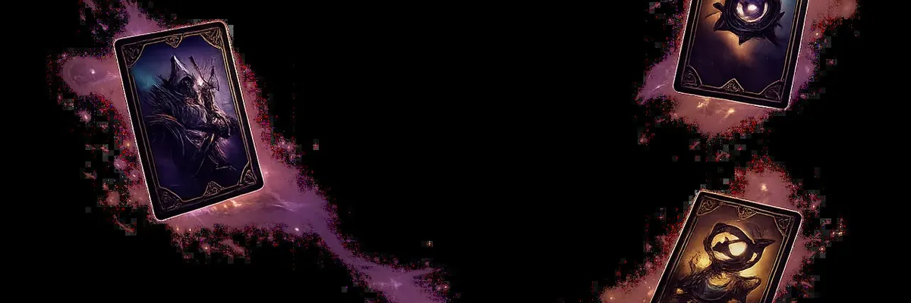

<a href="./README.md">
  <picture>
    <source media="(max-width: 720px)" srcset="./docs/assets/hero/nebula_sm.webp">
    
  </picture>
</a>

# Démarrer en 5 minutes

**Construire un deck. Poser des cartes. Vider la défense adverse.**

  
  

[← Retour au README](./README.md) · [Règles complètes](./docs/rules.md) · [Galerie](./CARDS-SHOWCASE.md) · [Communauté](./COMMUNITY.md)

---

## Le pitch en deux phrases

Tu construis un **grimoire de 40 cartes**, tu peux mélanger jusqu'à **3 univers**,
tu poses des unités sur ton plateau et tu vides progressivement la défense adverse.

Première partie en ligne : [**omnicard.fr**](https://omnicard.fr) — pas d'installation, pas de compte premium.

---

## Sommaire

1. [Les 5 types de cartes](#les-5-types-de-cartes)
2. [Les ressources](#les-ressources)
3. [Le plateau](#le-plateau)
4. [Composer un deck](#composer-un-deck)
5. [Statuts spéciaux](#statuts-spéciaux)
6. [Le déroulement d'une partie](#le-déroulement-dune-partie)
7. [Lancer une partie](#lancer-une-partie)
8. [Aller plus loin](#aller-plus-loin)

---

## Les 5 types de cartes

<table>
<tr>
  <th width="14%">Type</th>
  <th>Description</th>
</tr>
<tr>
  <td align="center"><strong>🛡️ Unité</strong></td>
  <td>Créature posée sur le plateau, <strong>attaque et encaisse</strong>. A des PV et une Attaque.</td>
</tr>
<tr>
  <td align="center"><strong>✨ Sort</strong></td>
  <td>Effet <strong>immédiat à usage unique</strong>, va au cimetière après résolution.</td>
</tr>
<tr>
  <td align="center"><strong>⚔️ Gear</strong></td>
  <td>Équipement attaché à une unité, lui ajoute PV et Attaque. <strong>Encaisse les coups en premier.</strong></td>
</tr>
<tr>
  <td align="center"><strong>🪤 Piège</strong></td>
  <td>Posé <strong>face cachée</strong>, se déclenche selon une condition adverse, se révèle à l'activation.</td>
</tr>
<tr>
  <td align="center"><strong>🌍 Terrain</strong></td>
  <td>Modifie les <strong>règles globales</strong> tant qu'il est en jeu. Un seul Terrain par joueur à la fois.</td>
</tr>
</table>

---

## Les ressources

<table>
<tr>
  <td width="20%" align="center"><strong>❤️ PV</strong></td>
  <td>Chacun commence à <strong>30</strong>. Premier à 0 perd.</td>
</tr>
<tr>
  <td align="center"><strong>💧 Mana</strong></td>
  <td>Démarre à <strong>2</strong>, +1 par tour, plafond <strong>10</strong>. Rempli à chaque début de tour.</td>
</tr>
<tr>
  <td align="center"><strong>💎 Cristaux</strong></td>
  <td>La mana <strong>non dépensée</strong> se convertit en Cristal au tour suivant (plafond 5). Réserve persistante, dépensée après le mana courant.</td>
</tr>
<tr>
  <td align="center"><strong>🌀 Extase</strong></td>
  <td>Mécanique secondaire. <strong>+1 par point de dégât infligé.</strong> Sert à payer certaines cartes ou à déclencher des effets à seuil.</td>
</tr>
</table>

---

## Le plateau

**Deux lignes** de 10 emplacements chacune (Front Line et Back Line). Toute unité peut attaquer
n'importe quelle unité ennemie, **sauf** si l'adversaire a une unité avec **Provocation** —
auquel cas tu dois la cibler en premier.

> ⚠️ **Tu ne peux attaquer le héros adverse que si son plateau est entièrement vide.**

---

## Composer un deck

- **40 cartes** au total.
- **Limites par carte** :
  - **Base** × 3 max
  - **Légendaire** × 1 max
  - **Invocation** jamais directement dans le deck (générées par effets)
- **Pas de contrainte d'univers** : tu peux jouer mono-Bloodborne ou mixer librement.

→ Détail dans [`docs/deck-building.md`](./docs/deck-building.md).

---

## Statuts spéciaux

| Statut | Description | Limite par deck |
|---|---|:---:|
| **Base** | La majorité des cartes | 3 copies |
| **Légendaire** | Cartes signatures | 1 copie |
| **Invocation** | Créée par un effet (ex. les Balles d'Argent générées par les Villageois) | — |

---

## Le déroulement d'une partie

<table>
<tr>
  <td align="center"><strong>1️⃣</strong></td>
  <td><strong>Mulligan</strong> — tu vois ta main de départ (6 cartes), tu peux renvoyer jusqu'à 5 cartes et repiocher autant.</td>
</tr>
<tr>
  <td align="center"><strong>2️⃣</strong></td>
  <td><strong>Tour 1 du joueur 1</strong> — il commence à 2 mana et pioche 1 carte.</td>
</tr>
<tr>
  <td align="center"><strong>3️⃣</strong></td>
  <td><strong>Tour 1 du joueur 2</strong> — il commence à 3 mana (compensation second joueur).</td>
</tr>
<tr>
  <td align="center"><strong>4️⃣</strong></td>
  <td><strong>Tours suivants</strong> — +1 mana max par tour, jusqu'à 10.</td>
</tr>
<tr>
  <td align="center"><strong>5️⃣</strong></td>
  <td><strong>Combat</strong> — toute unité peut attaquer dès qu'elle est <em>Prête à attaquer</em> (en général à partir du tour suivant sa pose, sauf cas spéciaux).</td>
</tr>
<tr>
  <td align="center"><strong>🏁</strong></td>
  <td><strong>Fin de partie</strong> — un joueur tombe à 0 PV, abandonne, ou un effet de victoire spécifique se déclenche (certaines Légendaires).</td>
</tr>
</table>

---

## Lancer une partie

  

Compte gratuit, progression sauvegardée. Tu peux jouer en **solo contre l'IA** pour t'entraîner,
en **duel privé via lobby**, ou directement en **mode Classé** une fois quelques parties
d'entraînement faites.

---

## Aller plus loin

<table>
<tr>
  <td>📘 <a href="./docs/rules.md"><strong>Règles complètes</strong></a></td>
  <td>Tous les détails du moteur.</td>
</tr>
<tr>
  <td>📖 <a href="./docs/keywords.md"><strong>Mots-clés</strong></a></td>
  <td>Glossaire des effets et attributs (Anti-Magie, Provocation, Esquive, Affûtage, Délai, Extase…).</td>
</tr>
<tr>
  <td>🔧 <a href="./docs/deck-building.md"><strong>Construction de deck</strong></a></td>
  <td>Limites, ratios, conseils.</td>
</tr>
<tr>
  <td>💎 <a href="./docs/economy.md"><strong>Économie de collection</strong></a></td>
  <td>Packs, fragments, decraft, drops pondérés.</td>
</tr>
<tr>
  <td>🏆 <a href="./docs/ranked.md"><strong>Mode Classé</strong></a></td>
  <td>Échelle Cosmique et Étincelles.</td>
</tr>
<tr>
  <td>🃏 <a href="./CARDS-SHOWCASE.md"><strong>Galerie de cartes</strong></a></td>
  <td>Cartes emblématiques par univers.</td>
</tr>
</table>

---

[← Retour au README](./README.md) · [Règles complètes →](./docs/rules.md)

