# Bloodborne — Catalogue complet

<a href="../../CARDS-SHOWCASE.md">← Showcase</a> · <a href="../../README.md">← README</a> · Autre univers : [JoJo's Bizarre Adventure](./jojo.md) · [WTF](./wtf.md)

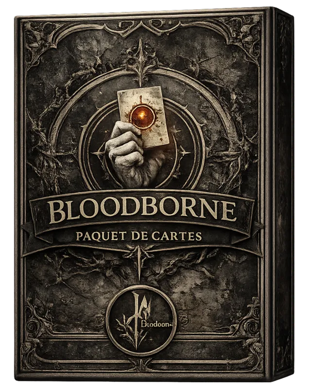

> Chasseurs, Bêtes, Gemmes à larme, Vieux Sang. L'univers le plus profond du jeu — mécaniques d'Affûtage, transformations, buffs de famille Chasseur et Grand.

**114 cartes** dans cet univers.

## Statistiques

| Métrique | Répartition |
|---|---|
| **Par type** | **Unités** 43 · **Sorts** 39 · **Gears** 22 · **Terrains** 7 · **Pièges** 3 |
| **Par rareté** | **Commune** 50 · **Rare** 29 · **Épique** 19 · **Ultime** 16 |
| **Par statut** | **Base** 68 · **Légendaire** 20 · **Invocation** 26 |

<h2 id="sommaire">Sommaire</h2>

- [Unités](#unités) — 41
- [Sorts](#sorts) — 23
- [Gears](#gears) — 16
- [Terrains](#terrains) — 7
- [Pièges](#pièges) — 1
- [Invocations](#invocations) — 26

<h2 id="unités">Unités (41)</h2>

<table>
<thead>
<tr>
<th width="110">Carte</th>
<th>Nom &amp; tags</th>
<th align="center" width="60">Coût</th>
<th align="center" width="70">Stats</th>
<th>Effet</th>
</tr>
</thead>
<tbody>
<tr id="card-132">
<td>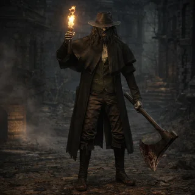</td>
<td><strong>Vilageois : Hache</strong> ID 132 · Commune · Base Bête, Chasseur</td>
<td align="center">1</td>
<td align="center">1/4</td>
<td>Fin de tour : Je m&#x27;inflige 1 point de dégât.</td>
</tr>
<tr id="card-133">
<td>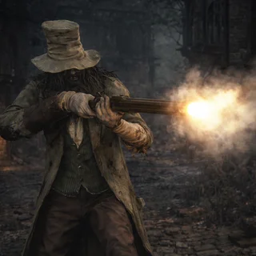</td>
<td><strong>Vilageois : Fusil</strong> ID 133 · Commune · Base Bête, Chasseur</td>
<td align="center">1</td>
<td align="center">2/2</td>
<td>Entrée en Scène : Placez une Balle en Argent dans votre Main.</td>
</tr>
<tr id="card-134">
<td>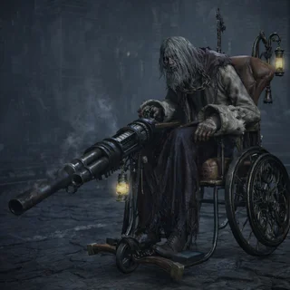</td>
<td><strong>Vilageois : Chaise</strong> ID 134 · Commune · Base Bête, Chasseur</td>
<td align="center">1</td>
<td align="center">1/2</td>
<td>Entrée en Scène : Place un Savoir de Dément dans votre Main.</td>
</tr>
<tr id="card-177">
<td>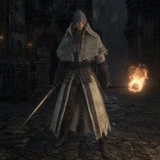</td>
<td><strong>Prospecteur de Tombe</strong> ID 177 · Commune · Base Chasseur, Calice</td>
<td align="center">1</td>
<td align="center">1/2</td>
<td>Entrée en Scène :  Je pioche une Rune.</td>
</tr>
<tr id="card-11">
<td>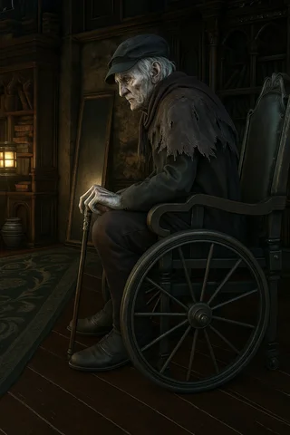</td>
<td><strong>Gehrman : Vieil Homme</strong> ID 11 · Rare · Base Chasseur</td>
<td align="center">2</td>
<td align="center">0/2</td>
<td>Affûtage(1,1).</td>
</tr>
<tr id="card-138">
<td>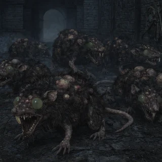</td>
<td><strong>Rat</strong> ID 138 · Commune · Base Bête</td>
<td align="center">2</td>
<td align="center">1/2</td>
<td>Extase -&gt; 2 : Ajoute Savoir de Dément dans votre jeu.</td>
</tr>
<tr id="card-139">
<td>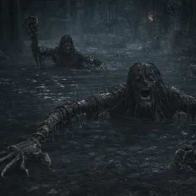</td>
<td><strong>Corps Pourissant</strong> ID 139 · Rare · Base Bête</td>
<td align="center">2</td>
<td align="center">0/3</td>
<td>Quand une unité alliée sur ma ligne subit des dégâts, je soigne une unité alliée aléatoire de 1.</td>
</tr>
<tr id="card-148">
<td>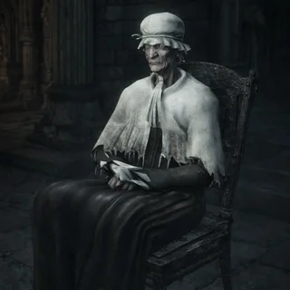</td>
<td><strong>La Veille Femme</strong> ID 148 · Rare · Base Humain</td>
<td align="center">2</td>
<td align="center">0/4</td>
<td>Tous les 8 points de dégâts infligés, pioche une carte.</td>
</tr>
<tr id="card-179">
<td>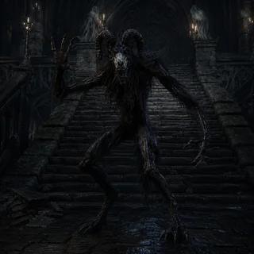</td>
<td><strong>Bête du Labyrinthe</strong> ID 179 · Rare · Base Bête, Labyrinthe</td>
<td align="center">2</td>
<td align="center">2/2</td>
<td>Quand vous jouez une Rune je gagne +1/+1.</td>
</tr>
<tr id="card-14">
<td>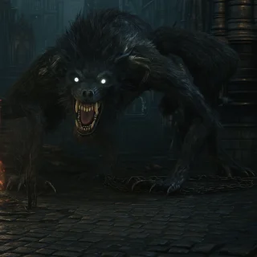</td>
<td><strong>Loup-Garou</strong> ID 14 · Commune · Base Bête, Monstre</td>
<td align="center">3</td>
<td align="center">3/3</td>
<td> Fin du Tour : Extase -&gt; 1 : gagne +1/+1.</td>
</tr>
<tr id="card-135">
<td>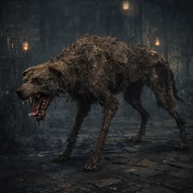</td>
<td><strong>Chien : Bête</strong> ID 135 · Commune · Base Bête</td>
<td align="center">3</td>
<td align="center">3/1</td>
<td>Extase(5) : Inflige 1 point de dégât à 3 unités</td>
</tr>
<tr id="card-136">
<td>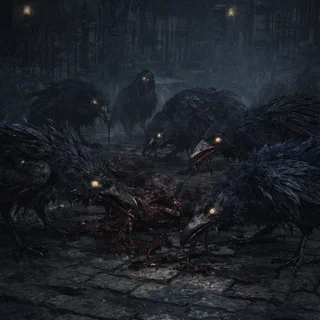</td>
<td><strong>Corbeau</strong> ID 136 · Rare · Base Bête</td>
<td align="center">3</td>
<td align="center">1/3</td>
<td>Chaque fois que votre adversaire invoque une unité, lui inflige un point de dégâts</td>
</tr>
<tr id="card-137">
<td>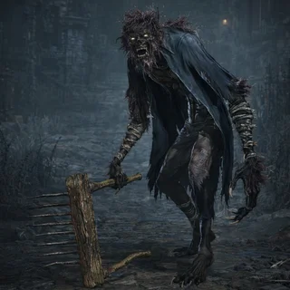</td>
<td><strong>Chasseur : Bête</strong> ID 137 · Commune · Base Bête, Chasseur</td>
<td align="center">3</td>
<td align="center">2/4</td>
<td>Fin de tour : J&#x27;inflige 1 point de dégâts à une unité alliée aléatoire. Extase -&gt; 1 : J&#x27;inflige 1 point de dégâts à une unité ennemie aléatoire.</td>
</tr>
<tr id="card-146">
<td>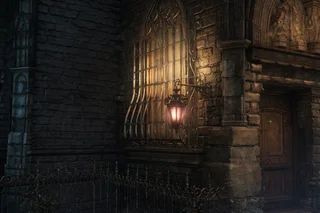</td>
<td><strong>Gilbert</strong> ID 146 · Épique · Base Chasseur, Bête</td>
<td align="center">3</td>
<td align="center">1/4</td>
<td>Tous les 8 points de dégâts infligés, ajoutez une Balle en Argent dans votre Main.</td>
</tr>
<tr id="card-167">
<td>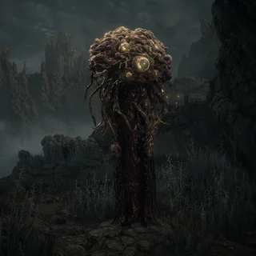</td>
<td><strong>Lanterne Hivernal</strong> ID 167 · Rare · Base Grand, Monstre</td>
<td align="center">3</td>
<td align="center">2/2</td>
<td>Délai(3) : Je détruit une unitée ennemis aléatoire.</td>
</tr>
<tr id="card-169">
<td>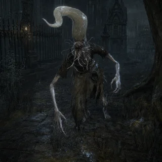</td>
<td><strong>Suceur de Cerveau</strong> ID 169 · Commune · Base Grand, Monstre</td>
<td align="center">3</td>
<td align="center">1/2</td>
<td>Entrée en Scène : Extase -&gt; 8 : Tous les Grand gagne +1/+1.</td>
</tr>
<tr id="card-141">
<td>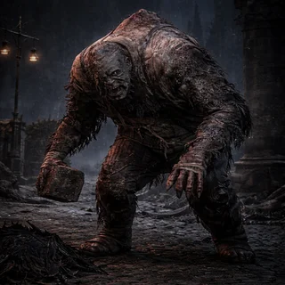</td>
<td><strong>Troll</strong> ID 141 · Épique · Base Bête</td>
<td align="center">4</td>
<td align="center">2/2</td>
<td>Extase -&gt; 5 : Inflige 1 point de dégâts sur toute la ligne opposée.</td>
</tr>
<tr id="card-147">
<td>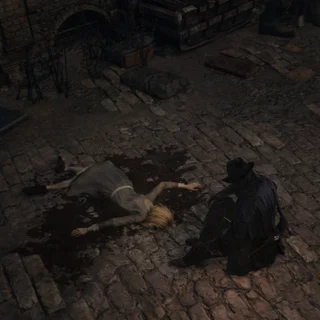</td>
<td><strong>La Petite Fille</strong> ID 147 · Ultime · Légendaire Humain</td>
<td align="center">4</td>
<td align="center">0/2</td>
<td>Extase -&gt; 40 : Défausse la main de votre adversaire. </td>
</tr>
<tr id="card-157">
<td>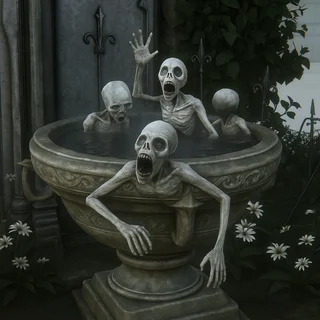</td>
<td><strong>Troupe de Messager</strong> ID 157 · Rare · Base Rêve, Messager</td>
<td align="center">4</td>
<td align="center">0/4</td>
<td>Esquive(3). Fin du Tour : Pioche une carte Offrande aléatoire.</td>
</tr>
<tr id="card-160">
<td>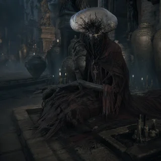</td>
<td><strong>Odeon</strong> ID 160 · Ultime · Base Grand</td>
<td align="center">5</td>
<td align="center">1/1</td>
<td>Je gagne +1/+1 pour chaque unité dans votre cimetière. Extase(20) : Mes bonus sont doublés.</td>
</tr>
<tr id="card-172">
<td>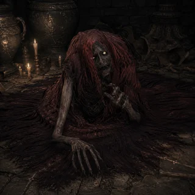</td>
<td><strong>Serviteur d&#x27;Odeon</strong> ID 172 · Commune · Base Humain</td>
<td align="center">5</td>
<td align="center">1/5</td>
<td>Toutes les 4 Runes jouée tous les Grand gagne +0/+1 ou qu&#x27;ils soit.</td>
</tr>
<tr id="card-178">
<td>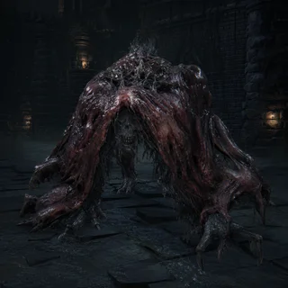</td>
<td><strong>Monstre Affamé</strong> ID 178 · Rare · Base Bête, Labyrinthe</td>
<td align="center">5</td>
<td align="center">3/7</td>
<td>Quand j&#x27;attaque je m&#x27;inflige la moitiée de mes dégats. Fin de Tour : me soigne de 1.</td>
</tr>
<tr id="card-144">
<td>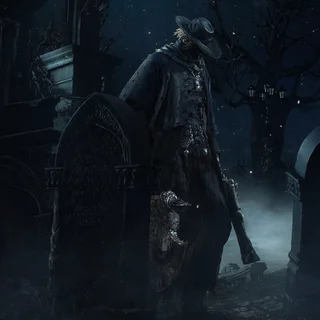</td>
<td><strong>Père Gascoigne</strong> ID 144 · Ultime · Légendaire Chasseur, Bête</td>
<td align="center">6</td>
<td align="center">2/8</td>
<td>Esquive(1). Fin du Tour : Extase -&gt; X : Invoque une bête aléatoire du cimetière, paye son coût en Extase.</td>
</tr>
<tr id="card-168">
<td>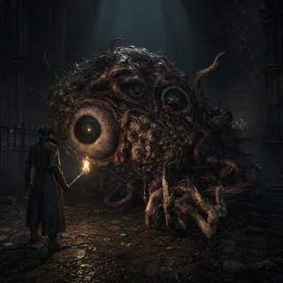</td>
<td><strong>Cerveau de Mensis</strong> ID 168 · Rare · Base Grand, Monstre</td>
<td align="center">6</td>
<td align="center">0/7</td>
<td>Délai(4) : Tous les Grand gagne +3/+3 ou qu&#x27;il soit.</td>
</tr>
<tr id="card-171">
<td>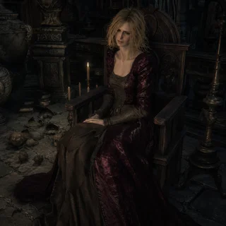</td>
<td><strong>Ariana</strong> ID 171 · Épique · Légendaire Humain</td>
<td align="center">6</td>
<td align="center">1/1</td>
<td>Si vous avez joué 14 Grand lors de la partie : Ajoute un Tier de Cordon Ombilical dans votre Deck.</td>
</tr>
<tr id="card-142">
<td>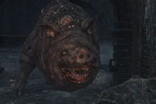</td>
<td><strong>Porc Géant</strong> ID 142 · Épique · Base Bête</td>
<td align="center">7</td>
<td align="center">2/4</td>
<td>Quand une unité subit des dégâts, je gagne +1/+0. Extase(10) : Gagne +1/+1 à la place.</td>
</tr>
<tr id="card-150">
<td>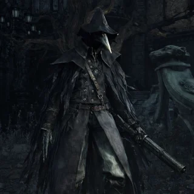</td>
<td><strong>Eileen : Chasseuse de Chasseur</strong> ID 150 · Épique · Base Chasseur</td>
<td align="center">7</td>
<td align="center">2/8</td>
<td>Quand vous jouez une carte Chasseur, infligez 1 point de dégât à une unité ennemie aléatoire.</td>
</tr>
<tr id="card-165">
<td>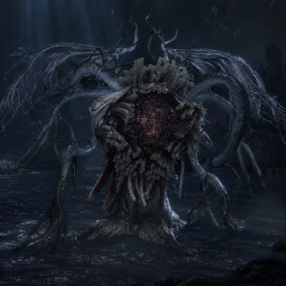</td>
<td><strong>Ebrietas</strong> ID 165 · Épique · Base Grand</td>
<td align="center">7</td>
<td align="center">4/8</td>
<td>Extase -&gt; 10 : Tous les Grand sur le Terrain gagne Esquive(1).</td>
</tr>
<tr id="card-13">
<td>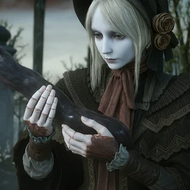</td>
<td><strong>La Poupée</strong> ID 13 · Ultime · Légendaire Grand</td>
<td align="center">8</td>
<td align="center">2/8</td>
<td>Anti-Magie. Fin du Tour : Pioche 2 Outils aléatoires dans votre Deck. Si vous n’en possédez plus dans votre Pioche, piochez 1 carte Chasseur aléatoire. Dernier Souffle : Crée l’Ornement à Cheveux.</td>
</tr>
<tr id="card-140">
<td>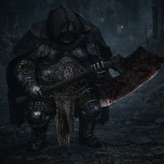</td>
<td><strong>Exectuteur</strong> ID 140 · Rare · Base Bête, Chasseur</td>
<td align="center">8</td>
<td align="center">5/5</td>
<td>Pour chaque tranche de 5 points d&#x27;Extase, mon coût est réduit de 2.</td>
</tr>
<tr id="card-161">
<td>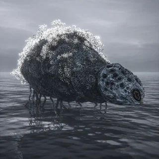</td>
<td><strong>Rome, l&#x27;araignée stupide</strong> ID 161 · Épique · Base Grand</td>
<td align="center">8</td>
<td align="center">2/5</td>
<td>Fin du Tour : Extase -&gt; 2 : Invoque une Araignée Stupide.</td>
</tr>
<tr id="card-166">
<td></td>
<td><strong>Amygdala</strong> ID 166 · Épique · Base Grand, Monstre</td>
<td align="center">8</td>
<td align="center">4/8</td>
<td>Extase -&gt; 20 : Tous les Grand sur le Terrain gagne Robustesse(1).</td>
</tr>
<tr id="card-149">
<td>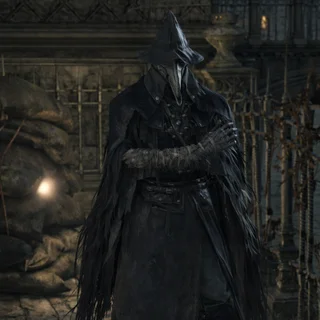</td>
<td><strong>Eileen : Conseillère</strong> ID 149 · Ultime · Légendaire Chasseur</td>
<td align="center">9</td>
<td align="center">4/6</td>
<td>Extase -&gt; 5 : Joue toutes les copies d&#x27;une carte d&#x27;un coût inférieur ou égal a 3 dans votre deck et votre main. Pour chaque carte jouée dans votre main, piochez une carte.</td>
</tr>
<tr id="card-12">
<td></td>
<td><strong>Iosefka</strong> ID 12 · Épique · Légendaire Chasseur, Médecin</td>
<td align="center">10</td>
<td align="center">6/3</td>
<td>Anti-Magie. Dernier Souffle : Ajoute un Tiers de Cordon Ombilical dans votre Deck. Fin du Tour : J’envoie un Chasseur allié au Cimetière, m’octroie ses bonus et donne +1/+1 au Grand allié.</td>
</tr>
<tr id="card-145">
<td>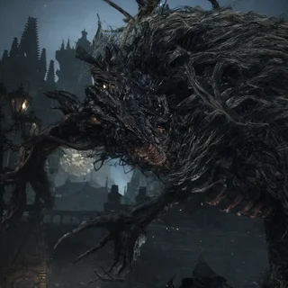</td>
<td><strong>Bête Clerical</strong> ID 145 · Ultime · Légendaire Bête</td>
<td align="center">10</td>
<td align="center">3/15</td>
<td>Provocation. Fin de tour : j&#x27;inflige 1 point de dégats à toutes les unitées.</td>
</tr>
<tr id="card-163">
<td>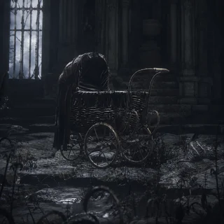</td>
<td><strong>Mergot</strong> ID 163 · Épique · Légendaire Grand</td>
<td align="center">11</td>
<td align="center">3/7</td>
<td>Entrée en Scène : Les Grand coûte -1 ou qu&#x27;il soit.</td>
</tr>
<tr id="card-10">
<td></td>
<td><strong>Gehrman : Premier Chasseur</strong> ID 10 · Ultime · Légendaire Chasseur, Boss</td>
<td align="center">12</td>
<td align="center">4/8</td>
<td>Fin du Tour : J’invoque un Chasseur d’un coût inférieur ou égal à 6. J’invoque et m’équipe de Lame Sépulcrale.</td>
</tr>
<tr id="card-16">
<td>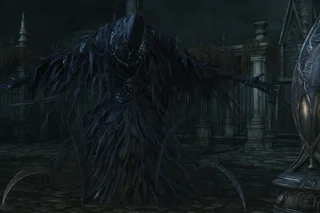</td>
<td><strong>Nourrice de Mergot</strong> ID 16 · Ultime · Légendaire Grand, Monstre</td>
<td align="center">12</td>
<td align="center">2/6</td>
<td>Entrée en Scène: Génère un Tiers de Cordon Ombilical. Fin du Tour : Pioche une carte Ésotérisme et la joue.</td>
</tr>
<tr id="card-164">
<td>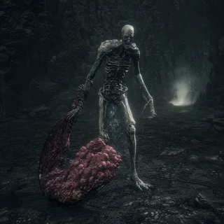</td>
<td><strong>L&#x27;orphelin de Cosm</strong> ID 164 · Ultime · Légendaire Grand</td>
<td align="center">12</td>
<td align="center">7/10</td>
<td>Quand je tue une unité je donne +1/+1 à tous les Grand ou qu&#x27;il soit.</td>
</tr>
<tr id="card-180">
<td>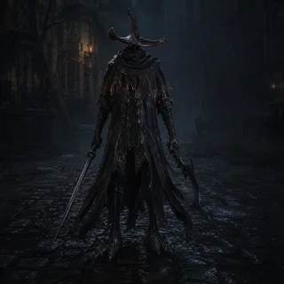</td>
<td><strong>Gardien des Dieux Ancien</strong> ID 180 · Épique · Base Chasseur, Labyrinthe</td>
<td align="center">12</td>
<td align="center">7/7</td>
<td>Toutes les 3 Rune joué mon cout est réduit de 2.</td>
</tr>
<tr id="card-17">
<td></td>
<td><strong>Présence Lunaire</strong> ID 17 · Ultime · Légendaire Grand, Boss</td>
<td align="center">14</td>
<td align="center">2/30</td>
<td>Provocation Totale. Entrée en Scène : Génère un Tiers de Cordon Ombilical. Fin du Tour : Je prends un Grand du Cimetière allié ou adverse, puis le remets dans votre main.</td>
</tr>
</tbody>
</table>

<a href="#sommaire">↑ Sommaire</a>

<h2 id="sorts">Sorts (23)</h2>

<table>
<thead>
<tr>
<th width="110">Carte</th>
<th>Nom &amp; tags</th>
<th align="center" width="60">Coût</th>
<th align="center" width="70">Stats</th>
<th>Effet</th>
</tr>
</thead>
<tbody>
<tr id="card-22">
<td>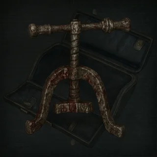</td>
<td><strong>Atelier des Gemmes</strong> ID 22 · Rare · Base Chasseur, Outil, Passif</td>
<td align="center">1</td>
<td align="center">—</td>
<td>Initiale. Tous les 5 Extase génèrent une Gemme aléatoire non-Légendaire dans votre main. Extase(30) : Peut aussi générer des Gemmes Légendaires.</td>
</tr>
<tr id="card-34">
<td></td>
<td><strong>Métamorphose Antihoraire</strong> ID 34 · Rare · Base Rune</td>
<td align="center">1</td>
<td align="center">—</td>
<td>Ajoute dans votre Deck :  Métamorphose Antihoraire +1, Métamorphose Antihoraire +2. Réduit vos PV max de 5. Puis pioche 3 cartes.</td>
</tr>
<tr id="card-158">
<td>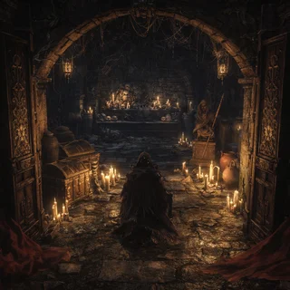</td>
<td><strong>Sur les traces de Yahrnam..</strong> ID 158 · Ultime · Légendaire Rêve, Labyrinthe, Messager</td>
<td align="center">1</td>
<td align="center">—</td>
<td>Si votre jeux de départ contient au moins 7 Equipement unique je suis Initial. Quand vous avez joué 2 Equipement, invoque un Messager.</td>
</tr>
<tr id="card-174">
<td>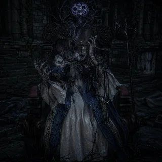</td>
<td><strong>Corruption par la Lucidité</strong> ID 174 · Commune · Base Lucidité, Chasseur</td>
<td align="center">1</td>
<td align="center">—</td>
<td>Détruit une unitée pour pioché 2 cartes.</td>
</tr>
<tr id="card-181">
<td>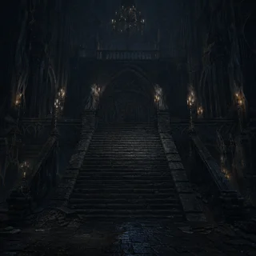</td>
<td><strong>Expédition dans les Trefond de Yahrnam</strong> ID 181 · Ultime · Légendaire Calice, Yahrnam, Chasseur</td>
<td align="center">1</td>
<td align="center">—</td>
<td>Si votre jeu de départ contient au moins 5 Rune unique, je suis Initiale. Tous les 5 sorts joué pioché une Rune.</td>
</tr>
<tr id="card-23">
<td>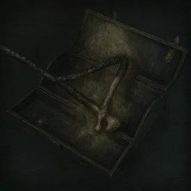</td>
<td><strong>Atelier des Runes</strong> ID 23 · Rare · Base Chasseur, Outil, Rune</td>
<td align="center">2</td>
<td align="center">—</td>
<td>Ajoute 5 Runes aléatoires dans votre jeu. Si votre jeu contient au moins 4 Runes, vous piochez 2 Runes. Si votre jeu contient au moins 6 Runes, je gagne Initiale.</td>
</tr>
<tr id="card-24">
<td></td>
<td><strong>Communion</strong> ID 24 · Rare · Base Rune, Chasseur</td>
<td align="center">2</td>
<td align="center">—</td>
<td>Abyssal. Ajoute dans votre Deck :  Communion +1, Communion +2, Communion +3, Communion +4. Vos soins sont augmentés de 1.</td>
</tr>
<tr id="card-31">
<td></td>
<td><strong>Lune</strong> ID 31 · Rare · Légendaire Rune</td>
<td align="center">2</td>
<td align="center">—</td>
<td>Ajoute dans votre Deck :  Lune +1, Lune +2. Gagnez 10 d&#x27;Extase</td>
</tr>
<tr id="card-37">
<td></td>
<td><strong>Métamorphose Horaire</strong> ID 37 · Rare · Base Rune</td>
<td align="center">2</td>
<td align="center">—</td>
<td>Ajoute dans votre Deck :  Métamorphose Horaire +1, Métamorphose Horaire +2. Augmente vos PV Max de 5.</td>
</tr>
<tr id="card-40">
<td></td>
<td><strong>Œdon Impalpable</strong> ID 40 · Rare · Base Rune</td>
<td align="center">2</td>
<td align="center">—</td>
<td>Abyssal. Ajoute dans votre Deck :  Oedon Impalpable +1, Oedon Impalpable +2. Vos Piège coute -1.</td>
</tr>
<tr id="card-44">
<td>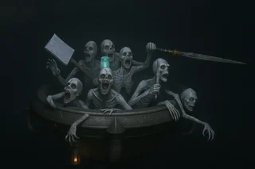</td>
<td><strong>Vasque : Écho du Sang</strong> ID 44 · Rare · Base Rêve, Grand, Messager</td>
<td align="center">2</td>
<td align="center">—</td>
<td>Vous pouvez sacrifier jusqu&#x27;à 3 cartes dans votre main, pour piocher autant de carte Messager.</td>
</tr>
<tr id="card-46">
<td>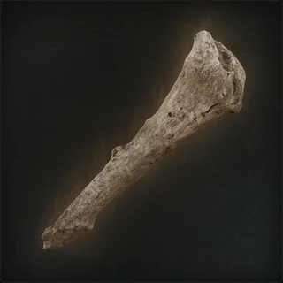</td>
<td><strong>Vieil Os de Chasseur</strong> ID 46 · Commune · Base Outil, Ésotérisme</td>
<td align="center">2</td>
<td align="center">—</td>
<td>Réutilisable(3). Confère Esquive(1) à un alié et gagne 1 d&#x27;Extase. Quand mon compteur Réutilisable tombe à 0, triple mes effets.</td>
</tr>
<tr id="card-143">
<td>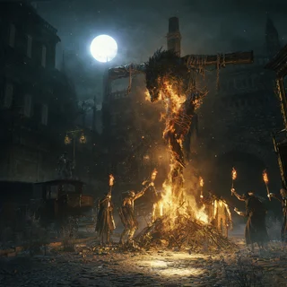</td>
<td><strong>Bête Crucifier</strong> ID 143 · Rare · Base Chasseur, Bête</td>
<td align="center">2</td>
<td align="center">—</td>
<td>Extase -&gt; X : Inflige X dégâts à une unité. Consomme toute votre Extase.</td>
</tr>
<tr id="card-21">
<td>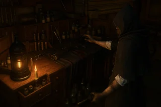</td>
<td><strong>Atelier des Armes</strong> ID 21 · Rare · Base Chasseur, Outil</td>
<td align="center">4</td>
<td align="center">—</td>
<td>Option: Génère la Hache du Chasseur; Génère le Courpet-Scie; Génère la Canne Fouet; Le coût de tous les Équipements Chasseur est réduit de 1.</td>
</tr>
<tr id="card-30">
<td></td>
<td><strong>Fleur du Crépuscule</strong> ID 30 · Rare · Base Rêve</td>
<td align="center">4</td>
<td align="center">—</td>
<td>Confère Anti-Magie à vos Unités sur le Terrain.</td>
</tr>
<tr id="card-41">
<td></td>
<td><strong>Pierre de Yharnam</strong> ID 41 · Ultime · Légendaire Gemme, Labyrinthe, Sang</td>
<td align="center">4</td>
<td align="center">—</td>
<td>Si vous avez joué 5 Gemmes lors de la partie, créez et jouez n’importe quelle Gemme.</td>
</tr>
<tr id="card-45">
<td>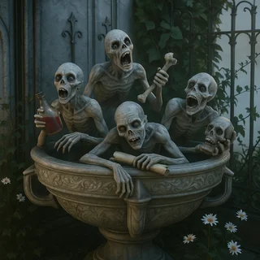</td>
<td><strong>Vasque : Lucidité</strong> ID 45 · Rare · Base Rêve, Grand, Messager</td>
<td align="center">4</td>
<td align="center">—</td>
<td>Si vous commencez la partie avec 9 Offrandes unique dans votre jeu cette carte est Initial. Vos Offrandes coutent -1.</td>
</tr>
<tr id="card-47">
<td></td>
<td><strong>Vision</strong> ID 47 · Rare · Légendaire Rune</td>
<td align="center">4</td>
<td align="center">—</td>
<td>Abyssal. Crée dans votre Deck :  Vision +1, Vision +2. Tous les 8 points de Mana dépensés, gagnez 1 Cristal.</td>
</tr>
<tr id="card-29">
<td>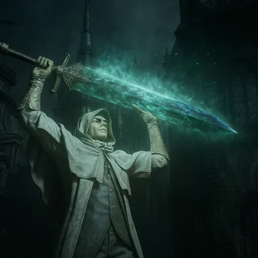</td>
<td><strong>Disciple de Ludwig</strong> ID 29 · Épique · Base Ésotérisme</td>
<td align="center">6</td>
<td align="center">—</td>
<td>Si vous avez joué 4 Gemmes Ésotérisme, piochez et jouez une Gemme Ésotérisme.</td>
</tr>
<tr id="card-173">
<td>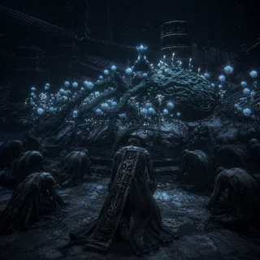</td>
<td><strong>Alégence au Grand</strong> ID 173 · Rare · Base Grand, Chasseur</td>
<td align="center">7</td>
<td align="center">—</td>
<td>Toutes les unités alliées qui ne sont pas des Grand gagne Provocation.</td>
</tr>
<tr id="card-170">
<td></td>
<td><strong>Rite d&#x27;assencion</strong> ID 170 · Ultime · Légendaire Grand, Chasseur</td>
<td align="center">13</td>
<td align="center">—</td>
<td>Oblitère un Chasseur pour jouer un Grand depuis le cimetière.</td>
</tr>
<tr id="card-176">
<td></td>
<td><strong>Conception Immaculé</strong> ID 176 · Ultime · Légendaire Grand, Chasseur</td>
<td align="center">14</td>
<td align="center">—</td>
<td>Si vous avez X Grand sur le Terrain  2 : Inflige 5 points de dégats à une unitée ennemis aléatoire. 5 : Inflige 1 point de dégats sur toute la ligne de Front adverse. 8 : Donne +2/+2 à toutes vos unités sur le Terrain. 12 : Invoque 1 Grand de votre cimetière</td>
</tr>
<tr id="card-42">
<td></td>
<td><strong>Stockage</strong> ID 42 · Épique · Base Chasseur, Outil</td>
<td align="center">15</td>
<td align="center">—</td>
<td>Joues 3 cartes aléatoire ne se trouvant pas dans votre Deck de Départ.</td>
</tr>
</tbody>
</table>

<a href="#sommaire">↑ Sommaire</a>

<h2 id="gears">Gears (16)</h2>

<table>
<thead>
<tr>
<th width="110">Carte</th>
<th>Nom &amp; tags</th>
<th align="center" width="60">Coût</th>
<th align="center" width="70">Stats</th>
<th>Effet</th>
</tr>
</thead>
<tbody>
<tr id="card-60">
<td></td>
<td><strong>Gemme : Ronde 1</strong> ID 60 · Commune · Base Gemme</td>
<td align="center">1</td>
<td align="center">0/0</td>
<td>Incrustation. Fin du Tour : Mon porteur gagne +1/+1.</td>
</tr>
<tr id="card-64">
<td></td>
<td><strong>Gemme: Triangle 1</strong> ID 64 · Commune · Base Gemme, Ésotérisme</td>
<td align="center">1</td>
<td align="center">1/0</td>
<td>Incrustation. Extase(15) : Les sorts Ésotérisme font +1 de dégâts.</td>
</tr>
<tr id="card-52">
<td></td>
<td><strong>Bandage de Tête des Messagers</strong> ID 52 · Commune · Base Rêve, Offrande, Messager</td>
<td align="center">2</td>
<td align="center">—/1</td>
<td>Entrée en Scène  : Me donne la catégorie Bête et pioche Bandage de Tête Ensanglanté des Messagers. Fin de Tour : Extase -&gt; 3 : Pioche une carte Bête aléatoire.</td>
</tr>
<tr id="card-53">
<td></td>
<td><strong>Bandage de Tête Ensanglanté des Messagers</strong> ID 53 · Commune · Base Rêve, Offrande, Messager</td>
<td align="center">2</td>
<td align="center">—/1</td>
<td>Entrée en Scène : Me donne la catégorie Chasseur et pioche Bandage de Tête des Messagers. Fin de Tour : Extase -&gt; 3 : Pioche une carte Chasseur aléatoire.</td>
</tr>
<tr id="card-65">
<td></td>
<td><strong>Gemme: Triangle 2</strong> ID 65 · Commune · Base Gemme, Ésotérisme</td>
<td align="center">2</td>
<td align="center">1/1</td>
<td>Incrustation. Extase(10) : Réduit de 1 le coût des cartes Ésotérisme.</td>
</tr>
<tr id="card-68">
<td></td>
<td><strong>Haut-de-Forme des Messagers</strong> ID 68 · Commune · Base Rêve, Offrande, Messager</td>
<td align="center">2</td>
<td align="center">—</td>
<td>Entrée en Scène : Extase -&gt; 3 : Confère Anti-magie a un allié. </td>
</tr>
<tr id="card-56">
<td></td>
<td><strong>Chapeau Noir des Messagers</strong> ID 56 · Commune · Base Rêve, Offrande, Messager</td>
<td align="center">3</td>
<td align="center">—/2</td>
<td>Anti-Magie.</td>
</tr>
<tr id="card-66">
<td></td>
<td><strong>Gemme: Triangle 3</strong> ID 66 · Rare · Base Gemme, Ésotérisme</td>
<td align="center">3</td>
<td align="center">2/1</td>
<td>Incrustation. Rechargement(2) : Pioche une carte Ésotérisme aléatoire.</td>
</tr>
<tr id="card-72">
<td></td>
<td><strong>Ruban Blanc des Messagers</strong> ID 72 · Commune · Base Rêve, Offrande, Messager</td>
<td align="center">3</td>
<td align="center">—</td>
<td>Quand vous posez un Monstre sur le Terrain il peut tout de suite attaquer.</td>
</tr>
<tr id="card-58">
<td></td>
<td><strong>Festival d’Urnes des Messagers</strong> ID 58 · Commune · Base Rêve, Offrande, Messager</td>
<td align="center">4</td>
<td align="center">0/2</td>
<td>Vos équipements coûtent -1.</td>
</tr>
<tr id="card-69">
<td></td>
<td><strong>Haut-de-Forme Usé des Messagers</strong> ID 69 · Commune · Base Rêve, Offrande, Messager</td>
<td align="center">4</td>
<td align="center">1/2</td>
<td>Tous les Chasseurs ailés ont +2/+0.</td>
</tr>
<tr id="card-73">
<td></td>
<td><strong>Ruban Rouge des Messagers</strong> ID 73 · Commune · Base Rêve, Offrande, Messager</td>
<td align="center">4</td>
<td align="center">1/2</td>
<td>Tous les Monstres alliés ont +2/+0.</td>
</tr>
<tr id="card-55">
<td></td>
<td><strong>Chapeau des Messagers de Yharnam</strong> ID 55 · Ultime · Légendaire Rêve, Offrande, Messager</td>
<td align="center">5</td>
<td align="center">1/1</td>
<td>Entrée en Scène : Si toutes les Offrandes des Messagers sont sur le Terrain, vous gagnez la partie.</td>
</tr>
<tr id="card-62">
<td></td>
<td><strong>Gemme : Ronde Arcane</strong> ID 62 · Commune · Base Gemme, Ésotérisme</td>
<td align="center">5</td>
<td align="center">2/2</td>
<td>Incrustation. Assassinat : Crée une carte Ésotérisme aléatoire non-Légendaire.</td>
</tr>
<tr id="card-61">
<td></td>
<td><strong>Gemme : Ronde 2</strong> ID 61 · Rare · Base Gemme</td>
<td align="center">6</td>
<td align="center">1/0</td>
<td>Incrustation. Quand mon porteur frappe, double son Attaque.</td>
</tr>
<tr id="card-63">
<td></td>
<td><strong>Gemme : Ronde Sang</strong> ID 63 · Rare · Base Gemme, Sang</td>
<td align="center">9</td>
<td align="center">6/0</td>
<td>Incrustation. Pour chaque tranche de 4 points d’Extase, gagne Esquive(1).</td>
</tr>
</tbody>
</table>

<a href="#sommaire">↑ Sommaire</a>

<h2 id="terrains">Terrains (7)</h2>

<table>
<thead>
<tr>
<th width="110">Carte</th>
<th>Nom &amp; tags</th>
<th align="center" width="60">Coût</th>
<th align="center" width="70">Stats</th>
<th>Effet</th>
</tr>
</thead>
<tbody>
<tr id="card-130">
<td></td>
<td><strong>Yharnam : Pont</strong> ID 130 · Commune · Base Bête</td>
<td align="center">2</td>
<td align="center">—</td>
<td>Quand vous jouez une unité, infligez-lui 1 point de dégât.</td>
</tr>
<tr id="card-18">
<td></td>
<td><strong>L&#x27;atelier du Chasseur</strong> ID 18 · Commune · Base Rêve</td>
<td align="center">4</td>
<td align="center">—</td>
<td>Affûtage(1,1).</td>
</tr>
<tr id="card-131">
<td></td>
<td><strong>Tombe d&#x27;Oedon</strong> ID 131 · Rare · Base Bête, Chasseur</td>
<td align="center">7</td>
<td align="center">—</td>
<td>Fin de Tour : Ajoute 2 Balles en Argent dans votre Main.</td>
</tr>
<tr id="card-20">
<td></td>
<td><strong>Le Rêve du Chasseur</strong> ID 20 · Rare · Base Rêve</td>
<td align="center">8</td>
<td align="center">—</td>
<td>Les gains d&#x27;Extase sont doublés.</td>
</tr>
<tr id="card-175">
<td></td>
<td><strong>Lune Sanglante</strong> ID 175 · Épique · Base Grand</td>
<td align="center">12</td>
<td align="center">—</td>
<td>Fin du Tour : Extase -&gt; 5 : Les Grand gagne +1/+0 ou qu&#x27;il soit.</td>
</tr>
<tr id="card-19">
<td></td>
<td><strong>L&#x27;atelier du Chasseur : Flame</strong> ID 19 · Commune · Base Rêve</td>
<td align="center">13</td>
<td align="center">—</td>
<td>La première carte jouée chaque round voit son prix réduit de 10. La prochaine carte jouée par la personne qui m’a posé a son coût réduit à 0.</td>
</tr>
<tr id="card-129">
<td></td>
<td><strong>Yharnam : Centre</strong> ID 129 · Épique · Base Bête</td>
<td align="center">13</td>
<td align="center">—</td>
<td>Vous pouvez consommer des points d&#x27;Extase pour me jouer. Quand vous gagnez ou consommez un point d&#x27;extase, donne +1/+1 à une unité aléatoire sur votre terrain.</td>
</tr>
</tbody>
</table>

<a href="#sommaire">↑ Sommaire</a>

<h2 id="pièges">Pièges (1)</h2>

<table>
<thead>
<tr>
<th width="110">Carte</th>
<th>Nom &amp; tags</th>
<th align="center" width="60">Coût</th>
<th align="center" width="70">Stats</th>
<th>Effet</th>
</tr>
</thead>
<tbody>
<tr id="card-159">
<td></td>
<td><strong>Salle Caché du Labyrinthe</strong> ID 159 · Épique · Base Calice, Labyrinthe, Messager</td>
<td align="center">3</td>
<td align="center">—</td>
<td>Si votre adversaire pose une unité d&#x27;un coup supérieur a 6 :  Invoque deux Messager sur votre ligne avant.</td>
</tr>
</tbody>
</table>

<a href="#sommaire">↑ Sommaire</a>

<h2 id="invocations">Invocations (26)</h2>

> Cartes générées par effets, jamais directement présentes dans un deck construit.

<table>
<thead>
<tr>
<th width="110">Carte</th>
<th>Nom &amp; tags</th>
<th align="center" width="60">Coût</th>
<th align="center" width="70">Stats</th>
<th>Effet</th>
</tr>
</thead>
<tbody>
<tr id="card-59">
<td></td>
<td><strong>Gemme : Larme</strong> ID 59 · Commune · Invocation Gemme, Rêve</td>
<td align="center">0</td>
<td align="center">1/1</td>
<td>Incrustation. Régénération.</td>
</tr>
<tr id="card-54">
<td></td>
<td><strong>Canne Fouet</strong> ID 54 · Commune · Invocation Outil, Chasseur</td>
<td align="center">1</td>
<td align="center">1/2</td>
<td>Si un Chasseur m’équipe, il gagne Esquive(2).</td>
</tr>
<tr id="card-57">
<td></td>
<td><strong>Coupret-Scie</strong> ID 57 · Commune · Invocation Outil, Chasseur</td>
<td align="center">1</td>
<td align="center">2/2</td>
<td>Si un Chasseur m’équipe, il gagne +0/+3.</td>
</tr>
<tr id="card-67">
<td></td>
<td><strong>Hache du Chasseur</strong> ID 67 · Commune · Invocation Outil, Chasseur</td>
<td align="center">1</td>
<td align="center">2/2</td>
<td>Si un Chasseur m’équipe, il gagne +3/+0.</td>
</tr>
<tr id="card-71">
<td></td>
<td><strong>Ornement de Cheveux</strong> ID 71 · Épique · Invocation</td>
<td align="center">1</td>
<td align="center">1/1</td>
<td>Dernier Souffle : Crée Gemme : Larme.</td>
</tr>
<tr id="card-70">
<td></td>
<td><strong>Lame Sépulcrale</strong> ID 70 · Épique · Invocation Outil, Chasseur</td>
<td align="center">5</td>
<td align="center">3/0</td>
<td>Quand je frappe j&#x27;applique 2 fois Extase. Extase(15) : Fin du Tour : Je détruis la Bête ennemie la plus faible.</td>
</tr>
<tr id="card-43">
<td></td>
<td><strong>Tiers de Cordon Ombilical</strong> ID 43 · Épique · Invocation Grand, Offrande</td>
<td align="center">0</td>
<td align="center">—</td>
<td>Récupère tous votre Mana. Si vous avez joué 3 Tiers de Cordon Ombilical, gagnez la partie.</td>
</tr>
<tr id="card-49">
<td></td>
<td><strong>Vision +2</strong> ID 49 · Commune · Invocation Rune</td>
<td align="center">0</td>
<td align="center">—</td>
<td>Extase -&gt; X : Gagne X/10 points de Mana.</td>
</tr>
<tr id="card-151">
<td></td>
<td><strong>Fiole de sang</strong> ID 151 · Commune · Invocation Sang, Chasseur</td>
<td align="center">0</td>
<td align="center">—</td>
<td>Abyssal. Génère un Crystale.</td>
</tr>
<tr id="card-152">
<td></td>
<td><strong>Balle en Argent</strong> ID 152 · Commune · Invocation Chasseur</td>
<td align="center">0</td>
<td align="center">—</td>
<td>Abyssal. Inflige 1 point de dégât à deux unités.</td>
</tr>
<tr id="card-153">
<td></td>
<td><strong>Savoir de dément</strong> ID 153 · Commune · Invocation Lucidité</td>
<td align="center">0</td>
<td align="center">—</td>
<td>Abyssal. Pioche 1 carte.</td>
</tr>
<tr id="card-25">
<td></td>
<td><strong>Communion +1</strong> ID 25 · Commune · Invocation Rune, Chasseur</td>
<td align="center">2</td>
<td align="center">—</td>
<td>Tous les 5 points d&#x27;Extase gagné je soigne une unitée aliée aléatoire de 1.</td>
</tr>
<tr id="card-26">
<td></td>
<td><strong>Communion +2</strong> ID 26 · Commune · Invocation Rune, Chasseur</td>
<td align="center">2</td>
<td align="center">—</td>
<td>Extase -&gt; X : Soigne une unitée a auteur des points d&#x27;Extase dépensé.</td>
</tr>
<tr id="card-27">
<td></td>
<td><strong>Communion +3</strong> ID 27 · Commune · Invocation Rune, Chasseur</td>
<td align="center">3</td>
<td align="center">—</td>
<td>Extase(10) : Soigne toutes vos unitées sur une ligne de 1 point.</td>
</tr>
<tr id="card-35">
<td></td>
<td><strong>Métamorphose Antihoraire +1</strong> ID 35 · Commune · Invocation Rune</td>
<td align="center">3</td>
<td align="center">—</td>
<td>Inflige 6 points de dégâts à une unité alliée ; si elle survit, inflige-en le double à une unité ennemie.</td>
</tr>
<tr id="card-38">
<td></td>
<td><strong>Métamorphose Horaire +1</strong> ID 38 · Commune · Invocation Rune</td>
<td align="center">3</td>
<td align="center">—</td>
<td>Soigne une unité puis la boost ces Pv du nombre de point de vie soigné.</td>
</tr>
<tr id="card-32">
<td></td>
<td><strong>Lune +1</strong> ID 32 · Commune · Invocation Rune</td>
<td align="center">6</td>
<td align="center">—</td>
<td>Pour chaque effet Extase j&#x27;inflige X point de dégats. Gagnez 5 Extase.</td>
</tr>
<tr id="card-33">
<td></td>
<td><strong>Lune +2</strong> ID 33 · Commune · Invocation Rune</td>
<td align="center">6</td>
<td align="center">—</td>
<td>Pour chaque effet Extase j&#x27;inflige X/10 point de dégat à sur une ligne. Gagnez 5 Extase.</td>
</tr>
<tr id="card-36">
<td></td>
<td><strong>Métamorphose Antihoraire +2</strong> ID 36 · Commune · Invocation Rune</td>
<td align="center">6</td>
<td align="center">—</td>
<td>Oblitère une unité alliée d’une force totale de 10 pour en générer et jouer une aléatoire d’un cout supérieur a 10.</td>
</tr>
<tr id="card-39">
<td></td>
<td><strong>Métamorphose Horaire +2</strong> ID 39 · Commune · Invocation Rune</td>
<td align="center">6</td>
<td align="center">—</td>
<td>Enchantement : Quand je me fais soigné, je répartie ce même montant en dégat sur les adversaires</td>
</tr>
<tr id="card-48">
<td></td>
<td><strong>Vision +1</strong> ID 48 · Commune · Invocation Rune</td>
<td align="center">7</td>
<td align="center">—</td>
<td>Le coût de votre prochaine carte est réduit de 10.</td>
</tr>
<tr id="card-28">
<td></td>
<td><strong>Communion +4</strong> ID 28 · Commune · Invocation Rune, Chasseur</td>
<td align="center">13</td>
<td align="center">—</td>
<td>Abyssal. Si Communion +1, +2 et +3 on été joué mon cout est de 0. Les Chasseurs gagne +2/+2 ou qu&#x27;il soit.</td>
</tr>
<tr id="card-50">
<td></td>
<td><strong>Œdon Impalpable +1</strong> ID 50 · Commune · Invocation Rune</td>
<td align="center">1</td>
<td align="center">—</td>
<td>Quand votre adversaire pose une unité, divise son attaque par 2.</td>
</tr>
<tr id="card-51">
<td></td>
<td><strong>Œdon Impalpable +2</strong> ID 51 · Commune · Invocation Rune</td>
<td align="center">4</td>
<td align="center">—</td>
<td>Quand votre adversaire pose une unité d’un coût de 6 ou plus, invoquez la première unité de votre jeu.</td>
</tr>
<tr id="card-15">
<td></td>
<td><strong>Messager</strong> ID 15 · Commune · Invocation Rêve, Messager</td>
<td align="center">0</td>
<td align="center">0/2</td>
<td>Esquive(1). Equipé : Fin du Tour : +1/+2.</td>
</tr>
<tr id="card-162">
<td></td>
<td><strong>Araignée Stupide</strong> ID 162 · Commune · Invocation Grand, Monstre</td>
<td align="center">0</td>
<td align="center">1/1</td>
<td>Délais(3) : Invoque une Araignée Stupide.</td>
</tr>
</tbody>
</table>

<a href="#sommaire">↑ Sommaire</a>

---

<a href="../../CARDS-SHOWCASE.md">← Retour au showcase</a> · [JoJo's Bizarre Adventure](./jojo.md) · [WTF](./wtf.md)

