# JoJo's Bizarre Adventure — Catalogue complet

<a href="../../CARDS-SHOWCASE.md">← Showcase</a> · <a href="../../README.md">← README</a> · Autre univers : [Bloodborne](./bloodborne.md) · [WTF](./wtf.md)

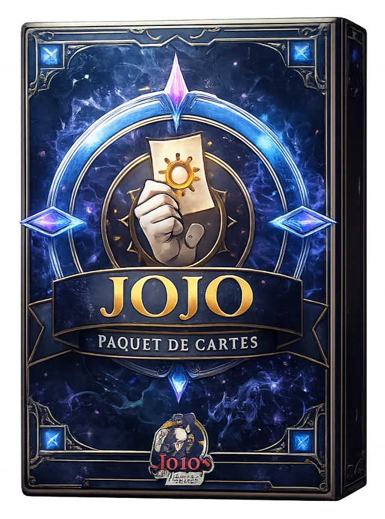

> Joestar, Vampires, Onde (Hamon). Centré sur les chaînes de transformation (Jonathan, Dio) et les combos de pose.

**51 cartes** dans cet univers.

## Statistiques

| Métrique | Répartition |
|---|---|
| **Par type** | **Unités** 25 · **Sorts** 11 · **Gears** 3 · **Terrains** 8 · **Pièges** 4 |
| **Par rareté** | **Commune** 27 · **Rare** 15 · **Épique** 6 · **Ultime** 3 |
| **Par statut** | **Base** 37 · **Légendaire** 8 · **Invocation** 6 |

<h2 id="sommaire">Sommaire</h2>

- [Unités](#unités) — 20
- [Sorts](#sorts) — 11
- [Gears](#gears) — 2
- [Terrains](#terrains) — 8
- [Pièges](#pièges) — 4
- [Invocations](#invocations) — 6

<h2 id="unités">Unités (20)</h2>

<table>
<thead>
<tr>
<th width="110">Carte</th>
<th>Nom &amp; tags</th>
<th align="center" width="60">Coût</th>
<th align="center" width="70">Stats</th>
<th>Effet</th>
</tr>
</thead>
<tbody>
<tr id="card-97">
<td>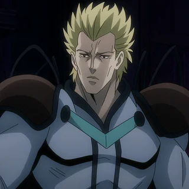</td>
<td><strong>Dire</strong> ID 97 · Commune · Base Onde</td>
<td align="center">1</td>
<td align="center">1/1</td>
<td>Je crée un sort Onde non-Légendaire.</td>
</tr>
<tr id="card-86">
<td></td>
<td><strong>Wang Chan</strong> ID 86 · Commune · Base Roublard, Vampire</td>
<td align="center">2</td>
<td align="center">1/3</td>
<td>Toutes les 3 unités qui vont au cimetière ou sont oblitéré, je pioche une carte.</td>
</tr>
<tr id="card-90">
<td>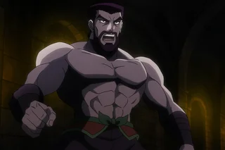</td>
<td><strong>Jack l&#x27;Eventreur</strong> ID 90 · Commune · Base Roublard, Vampire</td>
<td align="center">2</td>
<td align="center">2/2</td>
<td>Régénération. Génère une carte Roublard d&#x27;un cout de 3 ou moins Non-Légendaire. </td>
</tr>
<tr id="card-91">
<td>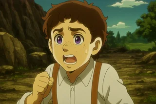</td>
<td><strong>Poco</strong> ID 91 · Commune · Base Roublard</td>
<td align="center">2</td>
<td align="center">1/1</td>
<td>Pioche une carte Joestar.</td>
</tr>
<tr id="card-92">
<td>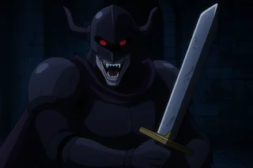</td>
<td><strong>Chevalier Mort Vivant</strong> ID 92 · Commune · Base Vampire</td>
<td align="center">2</td>
<td align="center">2/2</td>
<td>Fin du tour : je m’inflige -0/-1 pour gagner +1/+0.</td>
</tr>
<tr id="card-78">
<td>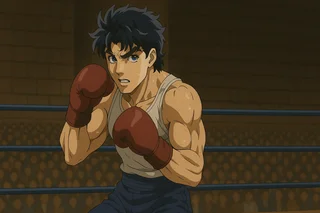</td>
<td><strong>Jonathan Joestar: Jeune</strong> ID 78 · Ultime · Légendaire Joestar</td>
<td align="center">3</td>
<td align="center">2/2</td>
<td>Si le total de mes stats est supérieur à 10, je me transforme en Jonathan Joestar.</td>
</tr>
<tr id="card-85">
<td>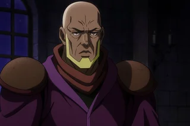</td>
<td><strong>Tonpetty</strong> ID 85 · Commune · Base Onde</td>
<td align="center">3</td>
<td align="center">3/3</td>
<td>Entrée en scène, Rechargement (2) : Pioche une carte Onde aléatoire.</td>
</tr>
<tr id="card-89">
<td>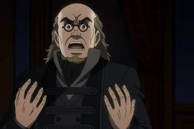</td>
<td><strong>Inspecteur Archeur</strong> ID 89 · Commune · Base Justice</td>
<td align="center">3</td>
<td align="center">1/1</td>
<td>Génère une carte Joestar Non-Légendaire.</td>
</tr>
<tr id="card-93">
<td>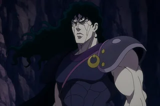</td>
<td><strong>Buford</strong> ID 93 · Commune · Base Vampire, Chevalier</td>
<td align="center">3</td>
<td align="center">1/2</td>
<td>Dernier souffle : Pioche Pluck.</td>
</tr>
<tr id="card-74">
<td>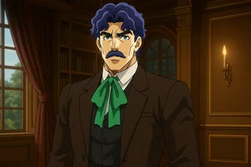</td>
<td><strong>George Joestar</strong> ID 74 · Commune · Base Joestar</td>
<td align="center">4</td>
<td align="center">2/2</td>
<td>Entrée en scène : Pour chaque tranche de 4 Joestar présents dans mon deck, je pioche une carte jusqu&#x27;à un maximum de 3.</td>
</tr>
<tr id="card-76">
<td></td>
<td><strong>Danny</strong> ID 76 · Épique · Légendaire Joestar, Chien</td>
<td align="center">4</td>
<td align="center">1/1</td>
<td>Dernier Souffle : Donne +1/+1 à toutes les cartes Joestar où qu&#x27;elles soient.  Pour chaque tranche de 4 Joestar joués ou invoqués lors de la partie, répète mon premier. Fin du tour : Si 6 Joestar alliés ou plus sont apparus sur le terrain pendant la partie, répète mon premier Dernier Souffle. </td>
</tr>
<tr id="card-77">
<td>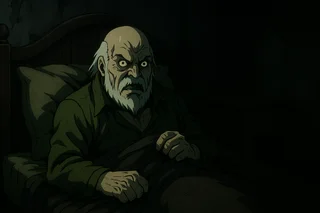</td>
<td><strong>Dario Brando</strong> ID 77 · Commune · Base Roublard</td>
<td align="center">4</td>
<td align="center">3/2</td>
<td>Espion (1). Délai (2) : Je donne la catégorie Vampire à une unité sur ma ligne qui ne la possède pas.</td>
</tr>
<tr id="card-94">
<td>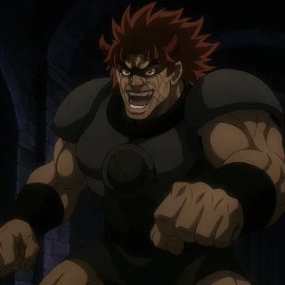</td>
<td><strong>Tarkus</strong> ID 94 · Commune · Base Vampire, Chevalier</td>
<td align="center">4</td>
<td align="center">2/3</td>
<td>Génère un Vampire non-Légendaire.</td>
</tr>
<tr id="card-82">
<td>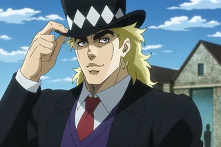</td>
<td><strong>Speedwagon</strong> ID 82 · Rare · Base Roublard</td>
<td align="center">5</td>
<td align="center">2/4</td>
<td>J’ai +0/+1 pour chaque Joestar sur le terrain. Si je suis équipé du Chapeau de Zeppeli, mon bonus passe à +0/+2.</td>
</tr>
<tr id="card-83">
<td></td>
<td><strong>Zeppeli</strong> ID 83 · Rare · Base Onde</td>
<td align="center">5</td>
<td align="center">5/4</td>
<td>Esquive (1). Les Joestar sur le terrain ont +1/+1. J’invoque et m’équipe du Chapeau de Zeppeli.</td>
</tr>
<tr id="card-87">
<td>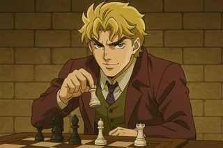</td>
<td><strong>Dio Brando: Jeune</strong> ID 87 · Ultime · Légendaire Roublard</td>
<td align="center">5</td>
<td align="center">4/6</td>
<td>Si je suis équipé du Masque de Pierre, je me transforme en Dio Brando : Vampire à la fin du tour.</td>
</tr>
<tr id="card-75">
<td>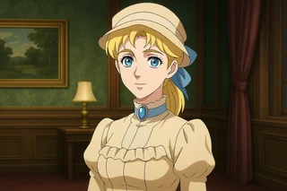</td>
<td><strong>Erina Pendleton</strong> ID 75 · Commune · Base Joestar</td>
<td align="center">6</td>
<td align="center">1/2</td>
<td>Dernier Souffle : Je donne tous mes bonus et attributs à une carte aléatoire sur cette ligne.</td>
</tr>
<tr id="card-96">
<td>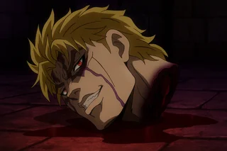</td>
<td><strong>Tête de Dio</strong> ID 96 · Rare · Base Vampire</td>
<td align="center">8</td>
<td align="center">5/5</td>
<td>Entrée en scène, Rechargement (2) : donne l’attribut Espion à une carte ennemie non-Légendaire.</td>
</tr>
<tr id="card-95">
<td>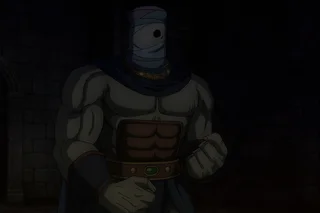</td>
<td><strong>Doobie l&#x27;étrange </strong> ID 95 · Rare · Légendaire Vampire, Serpant</td>
<td align="center">9</td>
<td align="center">7/7</td>
<td>Anti-Magie. J&#x27;ignore les effets de carte Piège. Pour chaque carte Piège déclenchée, je gagne +1/+1.</td>
</tr>
<tr id="card-98">
<td>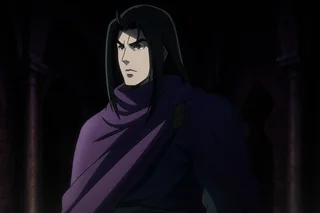</td>
<td><strong>Straizo : Humain</strong> ID 98 · Épique · Légendaire Onde</td>
<td align="center">9</td>
<td align="center">4/6</td>
<td>Pour chaque unité Onde sur le Terrain allié, je gagne les bonus suivants : 1-2: Je gagne Anti-Magie. 3-4: Toutes les unités sur ma ligne gagne Esquive(1). 5-6: J&#x27;inflige 2 points de dégàts à toutes les unités ennemis. 7 ou plus: Je pioche une carte Joestar, Onde et Roublard. </td>
</tr>
</tbody>
</table>

<a href="#sommaire">↑ Sommaire</a>

<h2 id="sorts">Sorts (11)</h2>

<table>
<thead>
<tr>
<th width="110">Carte</th>
<th>Nom &amp; tags</th>
<th align="center" width="60">Coût</th>
<th align="center" width="70">Stats</th>
<th>Effet</th>
</tr>
</thead>
<tbody>
<tr id="card-108">
<td></td>
<td><strong>Guérison de l&#x27;onde</strong> ID 108 · Commune · Base Technique, Onde</td>
<td align="center">2</td>
<td align="center">—</td>
<td>Octroie Régénération à une unité Non-Légendaire. Si vous avez joué 7 cartes Onde ou plus lors de la partie, cible aussi les unités Légendaires.</td>
</tr>
<tr id="card-109">
<td>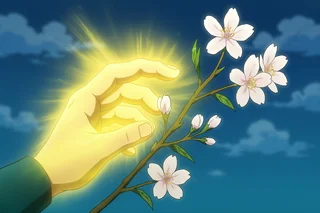</td>
<td><strong>Floraison de l&#x27;onde</strong> ID 109 · Commune · Base Technique, Onde, Nature</td>
<td align="center">3</td>
<td align="center">—</td>
<td>Octroie la catégorie Nature à 3 cartes sur le Terrain. Fixe les points de vie d’une unité alliée à 4.</td>
</tr>
<tr id="card-113">
<td>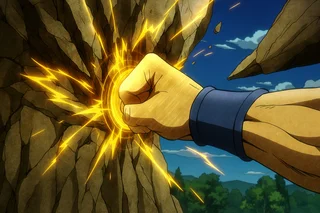</td>
<td><strong>Vibration de l&#x27;onde</strong> ID 113 · Commune · Base Technique, Onde</td>
<td align="center">3</td>
<td align="center">—</td>
<td>Retire la Provocation ou la Provocation Totale d&#x27;une carte.</td>
</tr>
<tr id="card-110">
<td>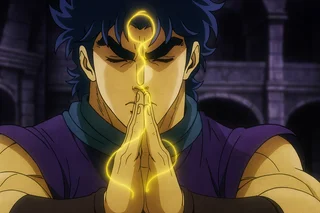</td>
<td><strong>Respiration: Concentration</strong> ID 110 · Épique · Légendaire Technique</td>
<td align="center">5</td>
<td align="center">—</td>
<td>Pioche 2 cartes Onde aléatoires. Si Zeppeli est de votre côté du terrain, génère une carte Onde supplémentaire. Si vous avez 10 Joestar, cette carte est Initiale.</td>
</tr>
<tr id="card-114">
<td>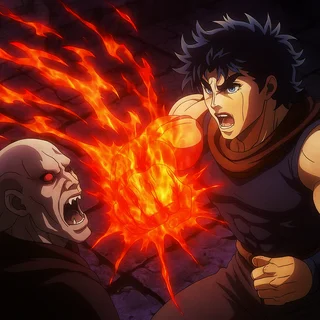</td>
<td><strong>Scarlet Overdrive</strong> ID 114 · Rare · Base Technique, Onde, Joestar </td>
<td align="center">5</td>
<td align="center">—</td>
<td>Détruit un Vampire. Si c&#x27;est un Vampire alié donne ces stats à une autre unité.</td>
</tr>
<tr id="card-107">
<td></td>
<td><strong>Projection d&#x27;onde</strong> ID 107 · Rare · Base Technique, Onde</td>
<td align="center">6</td>
<td align="center">—</td>
<td>J&#x27;inflige 1 point de dégât à une unité. Assassina : Répète l&#x27;effet aux cartes adjacentes. Dégâts doublés contre les vampires.</td>
</tr>
<tr id="card-111">
<td>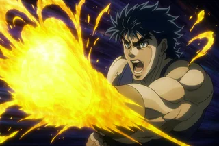</td>
<td><strong>Hamon Overdrive</strong> ID 111 · Ultime · Légendaire Technique, Onde, Joestar</td>
<td align="center">6</td>
<td align="center">—</td>
<td>J’inflige autant de dégâts que j’ai joué de cartes Onde lors de la partie. Dégâts doublés contre les vampires.</td>
</tr>
<tr id="card-112">
<td>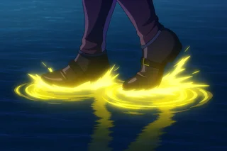</td>
<td><strong>Marche sur l&#x27;eau</strong> ID 112 · Commune · Base Technique, Onde</td>
<td align="center">6</td>
<td align="center">—</td>
<td>Active l&#x27;effet Combat Rapproché d&#x27;une carte non-Légendaire.</td>
</tr>
<tr id="card-116">
<td>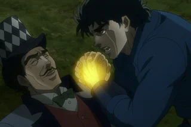</td>
<td><strong>Passe Overdrive </strong> ID 116 · Épique · Légendaire Technique, Onde</td>
<td align="center">8</td>
<td align="center">—</td>
<td>Réinvoque une unité du Cimetière.</td>
</tr>
<tr id="card-117">
<td>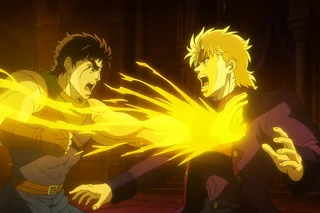</td>
<td><strong>Sunlight Yellow Overdrive </strong> ID 117 · Commune · Base Technique, Onde, Joestar </td>
<td align="center">10</td>
<td align="center">—</td>
<td>Détruit tous les Vampires sur le Terrain ennemi.</td>
</tr>
<tr id="card-115">
<td>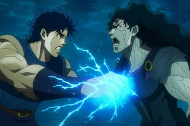</td>
<td><strong>Turquoise Blue Overdrive </strong> ID 115 · Rare · Base Technique, Onde, Joestar </td>
<td align="center">13</td>
<td align="center">—</td>
<td>Pour chaque carte Joestar que vous avez jouée lors de la partie, Défausse une carte du jeu de votre adversaire.</td>
</tr>
</tbody>
</table>

<a href="#sommaire">↑ Sommaire</a>

<h2 id="gears">Gears (2)</h2>

<table>
<thead>
<tr>
<th width="110">Carte</th>
<th>Nom &amp; tags</th>
<th align="center" width="60">Coût</th>
<th align="center" width="70">Stats</th>
<th>Effet</th>
</tr>
</thead>
<tbody>
<tr id="card-122">
<td>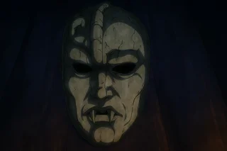</td>
<td><strong>Masque de Pierre</strong> ID 122 · Rare · Base Vampire</td>
<td align="center">5</td>
<td align="center">4/4</td>
<td>Régénération. Mon porteur devient un Vampire.</td>
</tr>
<tr id="card-123">
<td>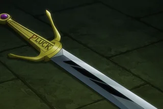</td>
<td><strong>Epée Pluck</strong> ID 123 · Épique · Base Joestar</td>
<td align="center">5</td>
<td align="center">0/0</td>
<td>—</td>
</tr>
</tbody>
</table>

<a href="#sommaire">↑ Sommaire</a>

<h2 id="terrains">Terrains (8)</h2>

<table>
<thead>
<tr>
<th width="110">Carte</th>
<th>Nom &amp; tags</th>
<th align="center" width="60">Coût</th>
<th align="center" width="70">Stats</th>
<th>Effet</th>
</tr>
</thead>
<tbody>
<tr id="card-103">
<td>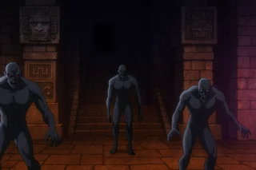</td>
<td><strong>Temple Inca</strong> ID 103 · Commune · Base Vampire</td>
<td align="center">1</td>
<td align="center">—</td>
<td>Tous les 15 points de dégâts infligés, les deux joueurs gagnent 1 PA.</td>
</tr>
<tr id="card-100">
<td>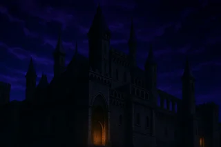</td>
<td><strong>Chateau de Dio</strong> ID 100 · Commune · Base Vampire</td>
<td align="center">2</td>
<td align="center">—</td>
<td>Fin du Tour : Fait apparaître une Goule mineure sur une ligne aléatoire de chaque côté du plateau.</td>
</tr>
<tr id="card-102">
<td>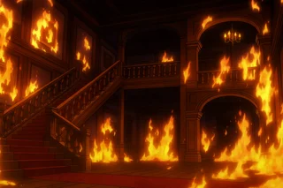</td>
<td><strong>Manoir des Joestar: Flame</strong> ID 102 · Rare · Base Joestar, Vampire</td>
<td align="center">2</td>
<td align="center">—</td>
<td>Fin du Tour : Toutes les unités en Combat Proche subissent 1 point de dégât.</td>
</tr>
<tr id="card-99">
<td>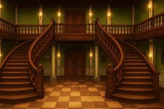</td>
<td><strong>Manoir des Joestar</strong> ID 99 · Commune · Base Joestar</td>
<td align="center">3</td>
<td align="center">—</td>
<td>Augmente de +1/+1 chaque fois qu’un bonus est donné aux cartes Joestar.</td>
</tr>
<tr id="card-101">
<td>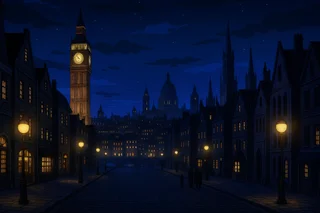</td>
<td><strong>Londre: Nocturne</strong> ID 101 · Commune · Base Vampire, Humain</td>
<td align="center">4</td>
<td align="center">—</td>
<td>Fin du Tour : Chaque joueur pioche une carte Roublard ou Joestar aléatoire.</td>
</tr>
<tr id="card-104">
<td></td>
<td><strong>Windknight&#x27;s Lot</strong> ID 104 · Commune · Base Vampire</td>
<td align="center">4</td>
<td align="center">—</td>
<td>Fin du Tour: Chaque joueur pioche une carte Onde ou Vampire aléatoire.</td>
</tr>
<tr id="card-105">
<td>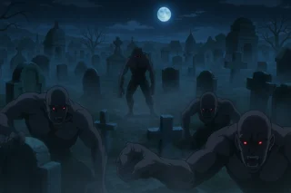</td>
<td><strong>Cimetière abandoné</strong> ID 105 · Commune · Base Vampire</td>
<td align="center">6</td>
<td align="center">—</td>
<td>Chaque tour invoque un Chevalier Mort-Vivant de chaque côté du Terrain sur une ligne aléatoire. Donne +1/+0 à tous les Vampire sur le Terrain. Donne +0/+1 à tous les Joestar sur le Terrain.</td>
</tr>
<tr id="card-106">
<td>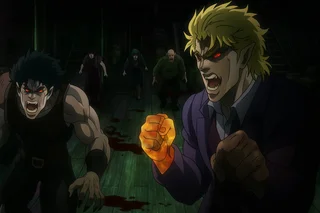</td>
<td><strong>Bateau Infesté de Vampire</strong> ID 106 · Rare · Base Vampire</td>
<td align="center">7</td>
<td align="center">—</td>
<td>Quand une carte d’un coût de 2 ou moins est jouée sur le Terrain, l’oblitère.</td>
</tr>
</tbody>
</table>

<a href="#sommaire">↑ Sommaire</a>

<h2 id="pièges">Pièges (4)</h2>

<table>
<thead>
<tr>
<th width="110">Carte</th>
<th>Nom &amp; tags</th>
<th align="center" width="60">Coût</th>
<th align="center" width="70">Stats</th>
<th>Effet</th>
</tr>
</thead>
<tbody>
<tr id="card-121">
<td>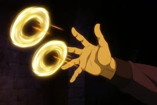</td>
<td><strong>Onde Cuteur</strong> ID 121 · Rare · Base Technique, Onde</td>
<td align="center">2</td>
<td align="center">—</td>
<td>Lorsque l’adversaire attaque, lui inflige des dégâts équivalents à l’attaque de son serviteur et annule l’attaque.</td>
</tr>
<tr id="card-118">
<td>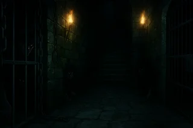</td>
<td><strong>Salle de Combat</strong> ID 118 · Commune · Base Vampire</td>
<td align="center">4</td>
<td align="center">—</td>
<td>Quand votre adversaire joue une unité d’un coût de 2 ou plus, la Purifie puis lui inflige Entrave (2).</td>
</tr>
<tr id="card-120">
<td>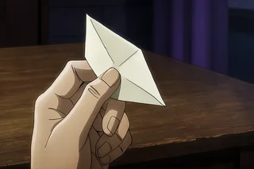</td>
<td><strong>Faux Médicament</strong> ID 120 · Commune · Base Nature</td>
<td align="center">4</td>
<td align="center">—</td>
<td>La prochaine unité jouée par l’adversaire subit Entrave (4). Si son coût est supérieur à 7, elle subit Entrave (2).</td>
</tr>
<tr id="card-119">
<td>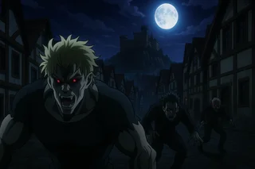</td>
<td><strong>Village Infecté</strong> ID 119 · Commune · Base Vampire</td>
<td align="center">6</td>
<td align="center">—</td>
<td>Quand votre adversaire joue une unité d’un coût de 5 ou moins, l’envoie au cimetière. Invoque 3 Goules mineures à la place.</td>
</tr>
</tbody>
</table>

<a href="#sommaire">↑ Sommaire</a>

<h2 id="invocations">Invocations (6)</h2>

> Cartes générées par effets, jamais directement présentes dans un deck construit.

<table>
<thead>
<tr>
<th width="110">Carte</th>
<th>Nom &amp; tags</th>
<th align="center" width="60">Coût</th>
<th align="center" width="70">Stats</th>
<th>Effet</th>
</tr>
</thead>
<tbody>
<tr id="card-124">
<td>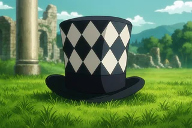</td>
<td><strong>Chapeau de Zeppeli</strong> ID 124 · Épique · Invocation Onde</td>
<td align="center">2</td>
<td align="center">1/1</td>
<td>Pour chaque tranche de 3 cartes Onde jouées lors de la partie, j’octroie +2/+1 à mon porteur.</td>
</tr>
<tr id="card-80">
<td></td>
<td><strong>Jonathan Joestar: Maitre de l&#x27;onde</strong> ID 80 · Rare · Invocation Joestar, Onde</td>
<td align="center">0</td>
<td align="center">12/6</td>
<td>Abyssal. Frappe distante. Pour chaque Vampire tué, toutes les carte Joestar gagne +2/1 ou qu&#x27;elle soit. Après avoir frappé 2 fois me transforme en Jonathan Joestar.</td>
</tr>
<tr id="card-81">
<td></td>
<td><strong>Jonathan Joestar: Maitre du combat</strong> ID 81 · Rare · Invocation Joestar, Roublard</td>
<td align="center">0</td>
<td align="center">6/9</td>
<td>Abyssal. Provocation Total. Tous les 5 points de dégâts subis, toutes les cartes Joestar gagnent +1/+2 où qu&#x27;elles soient. Après avoir subi 10 points de dégâts, me transforme en Jonathan Joestar.</td>
</tr>
<tr id="card-88">
<td></td>
<td><strong>Dio Brando: Vampire</strong> ID 88 · Rare · Invocation Roublard, Vampire</td>
<td align="center">0</td>
<td align="center">10/10</td>
<td>Abyssal. Pour chaque Vampire et Joestar mort lors de la partie je gagne +1/1.</td>
</tr>
<tr id="card-84">
<td>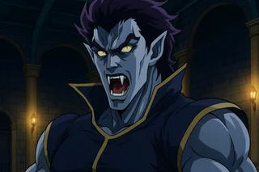</td>
<td><strong>Goule mineur</strong> ID 84 · Commune · Invocation Vampire</td>
<td align="center">1</td>
<td align="center">1/1</td>
<td>—</td>
</tr>
<tr id="card-79">
<td>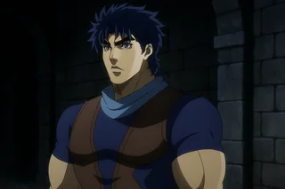</td>
<td><strong>Jonathan Joestar</strong> ID 79 · Rare · Invocation Joestar</td>
<td align="center">7</td>
<td align="center">5/5</td>
<td>Si Zeppeli est sur ma ligne, transforme-moi en Jonathan Joestar : Maître de l’onde au prochain tour. Si Speedwagon est sur ma ligne, transforme-moi en Jonathan Joestar : Maître du combat au prochain tour. Si les deux sont présents, je gagne Esquive (2).</td>
</tr>
</tbody>
</table>

<a href="#sommaire">↑ Sommaire</a>

---

<a href="../../CARDS-SHOWCASE.md">← Retour au showcase</a> · [Bloodborne](./bloodborne.md) · [WTF](./wtf.md)

