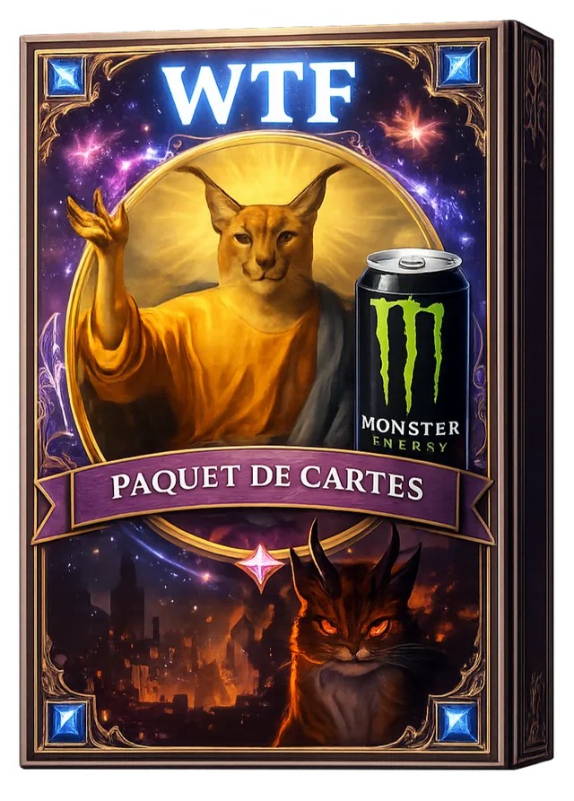
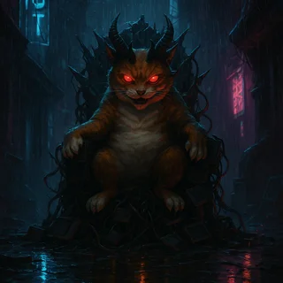
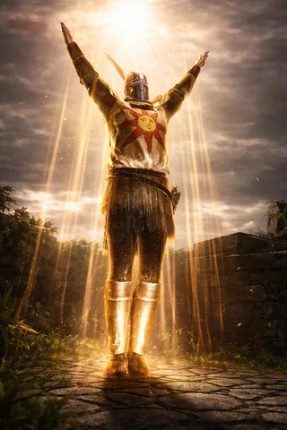
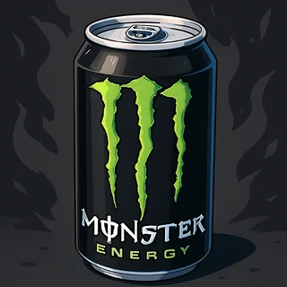
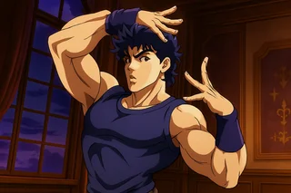
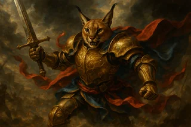

# WTF — Catalogue complet

<a href="../../CARDS-SHOWCASE.md">← Showcase</a> · <a href="../../README.md">← README</a> · Autre univers : [Bloodborne](./bloodborne.md) · [JoJo's Bizarre Adventure](./jojo.md)

> Cartes meme, références internet, chaos assumé. À utiliser pour casser le sérieux. Floppa, GitGud, Ricardo, Vibecoder.

**16 cartes** dans cet univers.

## Statistiques

| Métrique | Répartition |
|---|---|
| **Par type** | **Unités** 9 · **Sorts** 7 · **Gears** 0 · **Terrains** 0 · **Pièges** 0 |
| **Par rareté** | **Commune** 3 · **Rare** 6 · **Épique** 4 · **Ultime** 3 |
| **Par statut** | **Base** 7 · **Légendaire** 5 · **Invocation** 4 |

<h2 id="sommaire">Sommaire</h2>

- [Unités](#unités) — 5
- [Sorts](#sorts) — 7
- [Invocations](#invocations) — 4

<h2 id="unités">Unités (5)</h2>

<table>
<thead>
<tr>
<th width="110">Carte</th>
<th>Nom &amp; tags</th>
<th align="center" width="60">Coût</th>
<th align="center" width="70">Stats</th>
<th>Effet</th>
</tr>
</thead>
<tbody>
<tr id="card-128">
<td></td>
<td><strong>Vibecoder</strong> ID 128 · Rare · Base Skill Issue</td>
<td align="center">4</td>
<td align="center">0/2</td>
<td>Espion(1). Fin de tour : Retire un point de vie à mon joueur.</td>
</tr>
<tr id="card-155">
<td></td>
<td><strong>Ricardo</strong> ID 155 · Rare · Base Gambling</td>
<td align="center">4</td>
<td align="center">1/1</td>
<td>Chaque fois qu&#x27;une carte Wtf est posée, je gagne +1/+1 ou que je sois.</td>
</tr>
<tr id="card-154">
<td></td>
<td><strong>Sun Flower</strong> ID 154 · Épique · Légendaire PlantsVsZombie</td>
<td align="center">5</td>
<td align="center">0/3</td>
<td>Pioche un Terrain aléatoire dans votre Deck et divise son coût par deux. Si vous ne pouvez pas en piocher divise par deux le cout d&#x27;un Terrain dans votre main.</td>
</tr>
<tr id="card-3">
<td></td>
<td><strong>Azote</strong> ID 3 · Épique · Légendaire Bête, Démon</td>
<td align="center">7</td>
<td align="center">3/3</td>
<td>Quand une unité meurt, je gagne +1/+2.</td>
</tr>
<tr id="card-125">
<td></td>
<td><strong>SalesMan</strong> ID 125 · Épique · Légendaire Gambling</td>
<td align="center">7</td>
<td align="center">4/6</td>
<td>Génère 3 cartes aléatoires non légendaires d&#x27;un coût inférieur à 5 venant du jeu de votre adversaire.</td>
</tr>
</tbody>
</table>

<a href="#sommaire">↑ Sommaire</a>

<h2 id="sorts">Sorts (7)</h2>

<table>
<thead>
<tr>
<th width="110">Carte</th>
<th>Nom &amp; tags</th>
<th align="center" width="60">Coût</th>
<th align="center" width="70">Stats</th>
<th>Effet</th>
</tr>
</thead>
<tbody>
<tr id="card-4">
<td></td>
<td><strong>Sur les traces de Floppa..</strong> ID 4 · Ultime · Légendaire Chat, Singularité</td>
<td align="center">1</td>
<td align="center">—</td>
<td>Ajoute toutes les cartes Floppa dans votre jeu. Si à un moment tous les Floppa sont sur le Terrain allié : Fin du Tour : Invoque Floppa : Divinité.</td>
</tr>
<tr id="card-127">
<td></td>
<td><strong>Pray the Sun</strong> ID 127 · Ultime · Base Dark Souls</td>
<td align="center">1</td>
<td align="center">—</td>
<td>Pioche une carte de la série la plus présente dans votre deck de départ.</td>
</tr>
<tr id="card-126">
<td></td>
<td><strong>C#</strong> ID 126 · Commune · Base Skill Issue</td>
<td align="center">3</td>
<td align="center">—</td>
<td>Pioche 2 cartes. Affiche une équation aléatoire, si vous la résolvez, piochez une carte de plus.</td>
</tr>
<tr id="card-1">
<td></td>
<td><strong>Monster</strong> ID 1 · Commune · Base Malédiction</td>
<td align="center">4</td>
<td align="center">—</td>
<td>Permet à une unité d&#x27;attaquer.</td>
</tr>
<tr id="card-156">
<td></td>
<td><strong>Are you winning son ?</strong> ID 156 · Rare · Base Skill Issue</td>
<td align="center">4</td>
<td align="center">—</td>
<td>Videz votre cimetière, pour chaque carte supprimée du cimetière ajoute +1/+0 ou +0/+1 à une carte sur votre terrain.</td>
</tr>
<tr id="card-2">
<td></td>
<td><strong>Jojo Pose</strong> ID 2 · Commune · Base Joestar</td>
<td align="center">6</td>
<td align="center">—</td>
<td>Pioche et joue 2 carte aléatoire Wtf dans votre jeu.</td>
</tr>
<tr id="card-9">
<td></td>
<td><strong>GitGud</strong> ID 9 · Épique · Légendaire Dark Souls, Ez</td>
<td align="center">10</td>
<td align="center">—</td>
<td>Dans 5 tours, la partie se termine par une égalité.</td>
</tr>
</tbody>
</table>

<a href="#sommaire">↑ Sommaire</a>

<h2 id="invocations">Invocations (4)</h2>

> Cartes générées par effets, jamais directement présentes dans un deck construit.

<table>
<thead>
<tr>
<th width="110">Carte</th>
<th>Nom &amp; tags</th>
<th align="center" width="60">Coût</th>
<th align="center" width="70">Stats</th>
<th>Effet</th>
</tr>
</thead>
<tbody>
<tr id="card-6">
<td></td>
<td><strong>Floppa: Guerrier</strong> ID 6 · Rare · Invocation Guerrier, Singularité</td>
<td align="center">4</td>
<td align="center">3/4</td>
<td>Si mes PV sont supérieurs à 10, les dégâts que je subis sont divisés par deux. Si mes PV sont supérieurs à 15, je gagne Provocation Totale.</td>
</tr>
<tr id="card-5">
<td></td>
<td><strong>Floppa: Mage</strong> ID 5 · Rare · Invocation Mage, Singularité</td>
<td align="center">6</td>
<td align="center">0/4</td>
<td>Entrée en Scène : Je peux défausser un sort aléatoire de mon jeu pour gagner Anti-magie. Fin du tour : Je pioche une carte, si c&#x27;est un sort je gagne Esquive(1).</td>
</tr>
<tr id="card-8">
<td></td>
<td><strong>Floppa: Divinité</strong> ID 8 · Ultime · Invocation Singularité</td>
<td align="center">7</td>
<td align="center">0/70</td>
<td>Défausse le Deck de l&#x27;adversaire et envoie toutes les cartes sur son terrain au Cimetière. Puis fixe ces PV à 1 point de vie. Délai(2) : Inflige 100 points de dégâts à l’adversaire.</td>
</tr>
<tr id="card-7">
<td></td>
<td><strong>Floppa: Assassin</strong> ID 7 · Rare · Invocation Assassin, Singularité</td>
<td align="center">10</td>
<td align="center">3/1</td>
<td>Esquive(1). Pour chaque unité que je frappe, je gagne Esquive(1) et 1 Crystal. Assassinat : dégâts de recul ignorés.</td>
</tr>
</tbody>
</table>

<a href="#sommaire">↑ Sommaire</a>

---

<a href="../../CARDS-SHOWCASE.md">← Retour au showcase</a> · [Bloodborne](./bloodborne.md) · [JoJo's Bizarre Adventure](./jojo.md)

